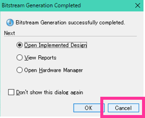
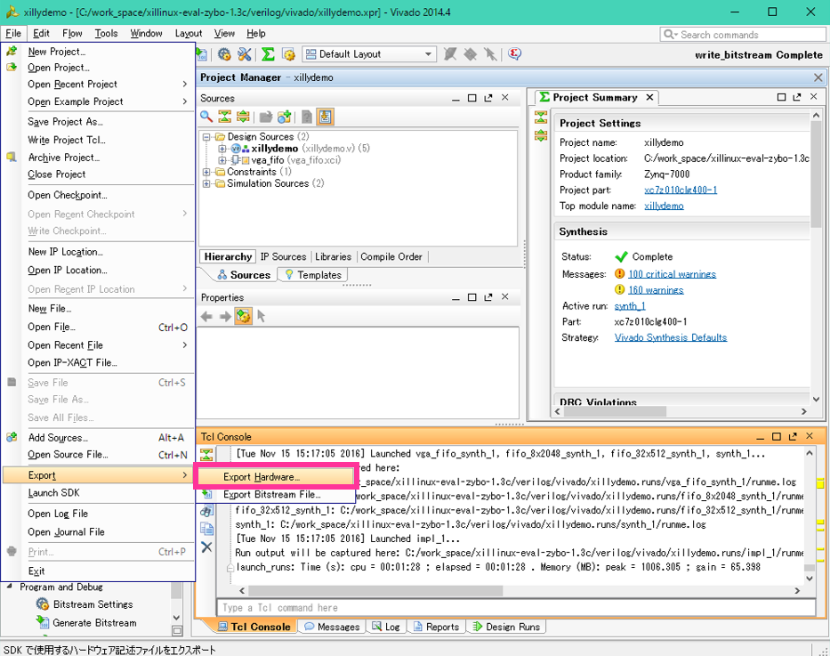
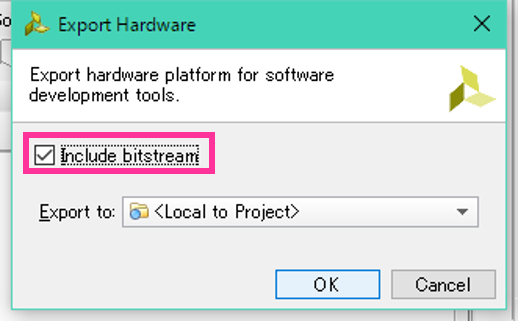
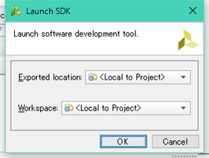
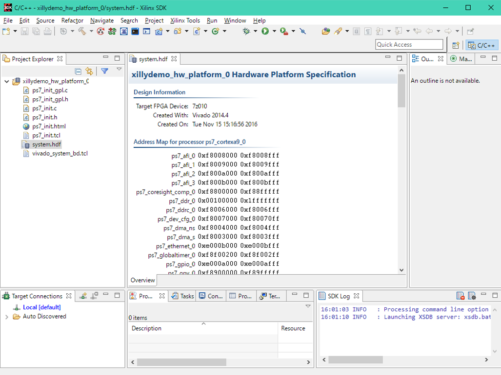
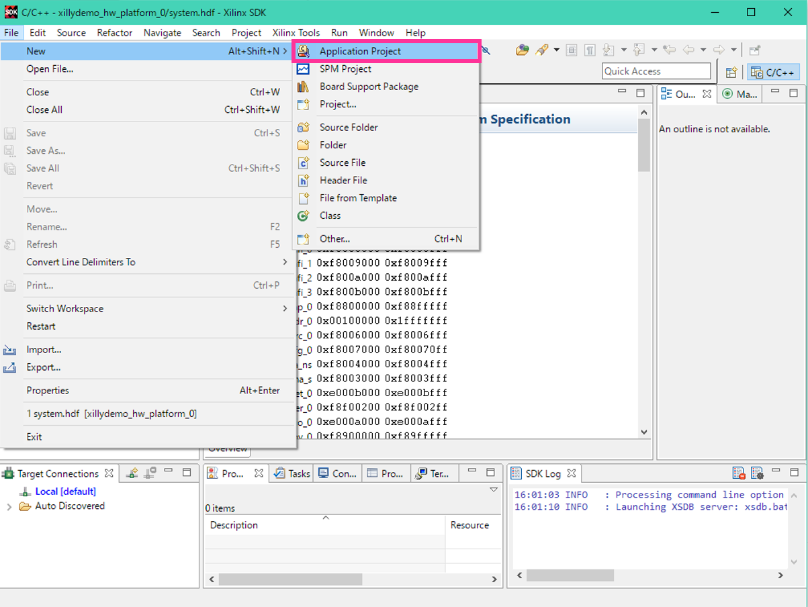

# Xillybus and ROS on Ubuntu on Zedboaed

###目標
DigilentのZedboard上でUbuntu14.04 + Xillybus + ROS indigoが動作するシステムを作る

###使用環境

本チュートリアルではLinuxマシンとWindowsマシンの両方を使用しています。  
どちらのマシンにもVivado14.04(SDKも)をインストールしてください。

- Linuxマシン：Ubuntu16.04 64bit
	- Vivado 2014.4
- Windowsマシン：Windows10 (回路の論理合成をするため。LinuxマシンのみでもOK)
	- Vivado 2014.4
- Zybo
- microSD 16GB：8GB以上推奨

<a name="Contents"></a>
###Contents

<!-- MarkdownTOC autolink="true" autoanchor="true" bracket="round" depth="3" -->

- [ハードウェアのビルド@Windows](#ハードウェアのビルドwindows)
- [u-bootのビルド@Ubuntu](#u-bootのビルドubuntu)
- [BOOT.binの生成@Windows](#bootbinの生成windows)
- [Linuxカーネルのビルド@Ubuntu](#linuxカーネルのビルドubuntu)
- [デバイスツリーファイル\(dtb\)の作成@Ubuntu](#デバイスツリーファイルdtbの作成ubuntu)
- [uEnv.txt作成@Ubuntu](#uenvtxt作成ubuntu)
- [Ubuntuのファイルシステムの取得@Ubuntu](#ubuntuのファイルシステムの取得ubuntu)
- [ブート用SDの作成@Ubuntu](#ブート用sdの作成ubuntu)
- [SDカードに書き込み@Ubuntu](#sdカードに書き込みubuntu)
- [起動テスト@Windows](#起動テストwindows)
- [Zybo上における設定@Zybo](#zybo上における設定zybo)
	- [xillybusのデバイスドライバのパーミッションの設定](#xillybusのデバイスドライバのパーミッションの設定)
	- [Swap領域を作る](#swap領域を作る)
	- [Proxyを設定する](#proxyを設定する)
	- [各種ツール導入](#各種ツール導入)
- [デモappを動かす@Zybo](#デモappを動かすzybo)
- [ROS indigoのインストール@Zybo](#ros-indigoのインストールzybo)
- [Complete!](#complete)
- [参考サイト](#参考サイト)
- [各種ドキュメント](#各種ドキュメント)

<!-- /MarkdownTOC -->

<a name="ハードウェアのビルドwindows"></a>
##ハードウェアのビルド@Windows

Windowsマシン上において、最初にCドライブ直下にワークスペース`C:\work_space`を作ります。  
以下、Windowsマシンにおける作業はこのワークスペースにおいて行います。  

[Xillybusのサイト](http://xillybus.com/)からzyboのベースデザイン[xillinux-eval-zedboard-1.3c.zip](http://xillybus.com/downloads/xillinux-eval-zedboard-1.3c.zip)(直リンク)をダウンロードしワークスペースに保存します。  

`C:\work_space\xillinux-eval-zedboard-1.3c.zip`

展開すると以下のようなディレクトリ構造になっています。

```
xillinux-eval-zedboard-1.3c/
|--bootfiles/
|--cores/
|--runonce/
|--system/
|--verilog/
|--vhdl/
|--vivado-essentials/
```

Vivado14.04を起動します。Vivadoを起動したら`Tools->Run Tcl Script`を選択し、  
`C:\work_space\xillinux-eval-zedboard-1.3c\verilog\xillydemo-vivado.tcl`を指定します。


XillybusのVivadoプロジェクトが起動します。  
プロジェクトが起動したら**Generate Bitstream**します。


完了したら以下のようなダイアログが出ますが、Cancelしてください。



[Contentsにもどる](#Contents)

<a name="u-bootのビルドubuntu"></a>
##u-bootのビルド@Ubuntu
Ubuntuマシン上において、最初にワークスペースを作ります。  
以下、Ubuntuマシンにおける作業はこのワークスペースにおいて行います。  

```
$ mkdir ~/work_dir
$ cd ~/work_dir
```

また、Vivado14.04のセッティングをします。

```
$ source /opt/Xilinx/Vivado/2014.4/settings64.sh
```

u-bootのためのソースコードを取得します。

```
$ git clone https://github.com/Xilinx/u-boot-xlnx.git
$ cd u-boot-xlnx/
```

使用しているVivadoのバージョンが2014.4なので、以下のようにチェックアウトします。

```
$ git checkout xilinx-v14.4
```

`u-boot-xlnx/include/configs/zynq-common.h`を以下のように編集します。


ZedboardにおいてSDカードの別パーティションからファイルシステムをマウントするために設定を変更します。  


```diff
	"sdboot=if mmcinfo; then " \
			"run uenvboot; " \
-			"echo Copying Linux from SD to RAM... && " \
+			"echo Copying Linux from SD to RAM... RFS in ext4 && " \
			"fatload mmc 0 ${kernel_load_address} ${kernel_image} && " \
			"fatload mmc 0 ${devicetree_load_address} ${devicetree_image} && " \
-			"fatload mmc 0 ${ramdisk_load_address} ${ramdisk_image} && " \
-			"bootm ${kernel_load_address} ${ramdisk_load_address} ${devicetree_load_address}; " \
+			"bootm ${kernel_load_address} - ${devicetree_load_address}; " \
		"fi\0" \
```

ビルドします。

```
$ export CROSS_COMPILE=arm-xilinx-linux-gnueabi-
$ export ARCH=arm
$ make zynq_zed_config
$ make
```

`~/u-boot-Digilent-Dev/`に**u-boot**が出来ていたら成功です。  
この**u-boot**をWindowsマシンの`C:\work_space`に**u-boot.elf**という名前でコピーします。


[Contentsにもどる](#Contents)


<a name="bootbinの生成windows"></a>
##BOOT.binの生成@Windows

先ほどビルドしたVivado上のハードウェアをエクスポートします。  
`File->Export->Export Hardware`を選択してください。



以下のダイアログが出ます。**Include bitstream**にチェックをつけてOKしてください。



SDKを起動します。`File->Launch SDK`を選択してください。


以下のダイアログが出ます。OKしてください。



SDKにおいてXillybusのプロジェクトが作成されました。



SDK上において`File->New->Application Project`を選択します
。



以下のダイアログでProject Nameに**FSBL**と入力しNextしてください。


また、Templateでは**Zynq FSBL**を選択しFinishします。


自動的にFSBLのプロジェクトが生成・ビルドされ  
`C:\work_space\xillinux-eval-zedboard-1.3c\verilog\vivado\xillydemo.sdk\FSBL\Debug`に**FSBL.elf**ができます。


SDK上においてFSBLフォルダで右クリックし、メニューから**Create Boot Image**を選択してください。


ダイアログにおいて**Add**し`C:\work_space\u-boot.elf`を選択し、OKします。


最終的なファイルは以下の3つです。

- (bootloader) FSBL.elf
- xillydemo.bit
- u-boot.elf

**xillydemo.bit**が選択されていない場合は  
`C:\work_space\xillinux-eval-zedboard-1.3c\verilog\vivado\xillydemo.sdk\xillydemo_hw_platform_0\xillydemo.bit`  
を**Add**してください。  

ファイルの確認ができたら**Create Image**してください。


`C:\work_space\xillinux-eval-zedboard-1.3c\verilog\vivado\xillydemo.sdk\FSBL\bootimage`  
に**BOOT.bin**が生成されていれば成功です。  
BOOT.binはUbuntuマシンの`~/work_dir`へコピーしておきましょう。

[Contentsにもどる](#Contents)

<a name="linuxカーネルのビルドubuntu"></a>
##Linuxカーネルのビルド@Ubuntu

Linuxカーネルのソースコードを取得します。

```
$ cd ~/work_dir
$ git clone -b master-next https://github.com/DigilentInc/Linux-Digilent-Dev.git
$ cd Linux-Digilent-Dev/
```

Zedboard用のデフォルトコンフィギュレーションをします。

```
$ make ARCH=arm CROSS_COMPILE=arm-xilinx-linux-gnueabi- xilinx_zynq_defconfig
```

ここで、LinuxカーネルにXillybusのデバイスドライバを導入するために`~/work_dir/Linux-Digilent-Dev/.config`を編集します。

```diff
# .config
# 1503行目あたり。"xilly"で検索してもいい。
- # CONFIG_XILLYBUS is not set
+ CONFIG_XILLYBUS=y
```

ビルドします。ビルドにはある程度時間がかかります。

```
$ make ARCH=arm CROSS_COMPILE=arm-xilinx-linux-gnueabi-
```

ビルドを開始すると、いくつか質問されます。**y**と入力してください。

```
Xillybus over PCIe (XILLYBUS_PCIE) [N/m/y/?] (NEW) y
Xillybus over Device Tree (XILLYBUS_OF) [N/m/y/?] (NEW) y
```

ビルドに成功すると`~/work_dir/Linux-Digilent-Dev/arch/arm/boot/`に**zImage**が生成されます。

uImageを作成します。

```
$ make ARCH=arm CROSS_COMPILE=arm-xilinx-linux-gnueabi- UIMAGE_LOADADDR=0x8000 uImage
```

ビルドに成功すると`~/work_dir/Linux-Digilent-Dev/arch/arm/boot/`に**uImage**が生成されます。  
uImageを`~/work_dir/`にコピーしておきます。

```
$ cd ~/work_dir/
$ cp Linux-Digilent-Dev/arch/arm/boot/uImage .
$ ls
BOOT.bin  Linux-Digilent-Dev  u-boot-Digilent-Dev  uImage
```


[Contentsにもどる](#Contents)

<a name="デバイスツリーファイルdtbの作成ubuntu"></a>
##デバイスツリーファイル(dtb)の作成@Ubuntu

dtbの作成に使用するdtsファイルは`/work_dir/Linux-Digilent-Dev/arch/arm/boot/dts/zynq-zed.dts`です。  
この際、**zynq-zed.dts**では`/work_dir/Linux-Digilent-Dev/arch/arm/boot/dts/zynq-7000.dtsi`をインクルードしています。**zynq-7000.dtsi**ではZynqシリーズのチップに共通する設定が記述されています。  
今回は、**zynq-7000.dtsi**にXillybusのIPの情報を追加します。また、**zynq-zed.dts**にはブートする際の設定を記述します。

```
$ cd ~/work_dir/Linux-Digilent-Dev/arch/arm/boot/dts
```

最初に、**zynq-7000.dtsi**の編集内容は以下の通りです。

```diff
/ {
	compatible = "xlnx,zynq-7000";
:
:
:
	amba: amba {
			compatible = "simple-bus";
			#address-cells = <1>;
			#size-cells = <1>;
			interrupt-parent = <&intc>;
			ranges;
			/*"amba"のブロックの中*/
:
:
:
/*391行目あたり*/
		usb1: usb@e0003000 {
			clocks = <&clkc 29>;
			compatible = "xlnx,ps7-usb-1.00.a", "xlnx,zynq-usb-1.00.a";
			status = "disabled";s
			interrupt-parent = <&intc>;
			interrupts = <0 44 4>;
			reg = <0xe0003000 0x1000>;
		};
+		xillyvga@50001000 {
+			compatible = "xillybus,xillyvga-1.00.a";
+			reg = < 0x50001000 0x1000 >;
+		} ;
+		xillybus@50000000 {
+			compatible = "xillybus,xillybus-1.00.a";
+			reg = < 0x50000000 0x1000 >;
+			interrupts = < 0 59 1 >;
+			interrupt-parent = <&intc>;
+			dma-coherent;
+		} ;
+		xillybus_lite@50002000 {
+			compatible = "xillybus,xillybus_lite_of-1.00.a";
+			reg = < 0x50002000 0x1000 >;
+			interrupts = < 0 58 1 >;
+			interrupt-parent = <&intc>;
+		} ;
	} ;
} ;
```

次に**zynq-zed.dts**の編集内容です。

```diff

	chosen {
-		bootargs = "console=ttyPS0,115200 root=/dev/ram rw earlyprintk";
+		bootargs = "console=ttyPS0,115200 root=/dev/mmcblk0p2 rw earlyprintk rootfstype=ext4 rootwait devtmpfs.mount=1";
		linux,stdout-path = "/amba/serial@e0001000";
	};
```

編集が完了したら、ビルドします。

```
$ cd ~/work_dir/Linux-Digilent-Dev
$ ./scripts/dtc/dtc -I dts -O dtb -o ../devicetree.dtb arch/arm/boot/dts/zynq-zed.dts
```

ビルドに成功すると`~/work_dir`に**devicetree.dtb**ができています。

[Contentsにもどる](#Contents)

<a name="uenvtxt作成ubuntu"></a>
##uEnv.txt作成@Ubuntu

uEnv.txtを作成します。

```
$ cd ~/work_dir
$ cat <<EOT>> uEnv.txt
uenvcmd=fatload mmc 0 0x03000000 uImage && fatload mmc 0 0x02A00000 devicetree.dtb && bootm 0x03000000 - 0x02A00000
EOT
```

[Contentsにもどる](#Contents)

<a name="ubuntuのファイルシステムの取得ubuntu"></a>
##Ubuntuのファイルシステムの取得@Ubuntu

以下URLからUbuntu14.04 armhfのルートファイルシステムをダウンロードできます。  
なお、今回はwgetで取得しますのでwebサイトにおけるダウンロードはいりません。  

**[http://www.armhf.com/download/](http://www.armhf.com/download/)**


ワークスペースにファイルシステムをダウンロードします。

```
$ cd ~/work_dir
$ wget http://s3.armhf.com/dist/basefs/ubuntu-trusty-14.04-armhf.com-20140603.tar.xz
```

ダウンロードしたファイルシステム用のディレクトリを作成し、展開します。  
以下のコマンドで展開に失敗する場合はGUIからも展開できます。

```
$ mkdir ubuntu_rootfs
$ cd ubuntu_rootfs
$ tar -Jxvf ../ubuntu-trusty-14.04-armhf.com-20140603.tar.xz
```

展開に成功すると以下のようなディレクトリができます。

```
bin  boot  dev  etc  home  lib  media  mnt  opt  proc  root  run  sbin  srv  sys  tmp  usr  var
```


[Contentsにもどる](#Contents)

<a name="ブート用sdの作成ubuntu"></a>
##ブート用SDの作成@Ubuntu

Zybo上でUbuntuを起動するために、SDカード(microSD)にパーティションを作成します。  
使用するSDカードは**8GB**以上をおすすめします。  
  

UbuntuマシンにSDカードを挿入したあと、lsblkでマウント状況を確認しましょう。  
以下の場合では/dev/sdcとしてマウントされています。

```
$ lsblk 
NAME                 MAJ:MIN RM   SIZE RO TYPE MOUNTPOINT
sda                    8:0    0 465.8G  0 disk 
├─sda1                 8:1    0   100M  0 part /media/kazushi/システムで予約済み
├─sda2                 8:2    0   117G  0 part /media/kazushi/F08875B788757D42
├─sda3                 8:3    0  31.3G  0 part /media/kazushi/DATA
├─sda5                 8:5    0   500M  0 part /media/kazushi/17c35461-41ed-4453-a0c7-b02c06fd6cae
└─sda6                 8:6    0   317G  0 part 
  ├─vg_degin-lv_root 252:0    0    50G  0 lvm  /media/kazushi/213acf4e-1831-423a-8b40-90f9cb41d727
  ├─vg_degin-lv_home 252:1    0 263.1G  0 lvm  /media/kazushi/01618d57-6dc1-4817-9980-3fd6b5134a73
  └─vg_degin-lv_swap 252:2    0   3.9G  0 lvm  
sdb                    8:16   0 232.9G  0 disk 
├─sdb1                 8:17   0   7.5G  0 part [SWAP]
└─sdb5                 8:21   0 225.4G  0 part /
sdc                    8:32   1  14.9G  0 disk 
sr0                   11:0    1  1024M  0 rom  
loop0                  7:0    0   1.7G  0 loop /mnt
```

fdiskコマンドでパーティションを作成します。SDカードのパーティションが何もないところから始めてください。  
まず、第1パーティションを作成します。このパーティションはブートローダやLinuxカーネルが入ります。

- p：プライマリ、First sector：デフォルト、Last sector：+64Mbyte

```
$ sudo fdisk /dev/sdc 

Welcome to fdisk (util-linux 2.27.1).
Changes will remain in memory only, until you decide to write them.
Be careful before using the write command.


コマンド (m でヘルプ): p
Disk /dev/sdc: 14.9 GiB, 15931539456 bytes, 31116288 sectors
Units: sectors of 1 * 512 = 512 bytes
Sector size (logical/physical): 512 bytes / 512 bytes
I/O size (minimum/optimal): 512 bytes / 512 bytes
Disklabel type: dos
Disk identifier: 0xcc4a40d8

コマンド (m でヘルプ): n
Partition type
   p   primary (0 primary, 0 extended, 4 free)
   e   extended (container for logical partitions)
Select (default p): p
パーティション番号 (1-4, default 1): 1
First sector (2048-31116287, default 2048): 
Last sector, +sectors or +size{K,M,G,T,P} (2048-31116287, default 31116287): +64M

Created a new partition 1 of type 'Linux' and of size 64 MiB.

コマンド (m でヘルプ): p
Disk /dev/sdc: 14.9 GiB, 15931539456 bytes, 31116288 sectors
Units: sectors of 1 * 512 = 512 bytes
Sector size (logical/physical): 512 bytes / 512 bytes
I/O size (minimum/optimal): 512 bytes / 512 bytes
Disklabel type: dos
Disk identifier: 0xcc4a40d8

デバイス   起動 Start 最後から セクタ Size Id タイプ
/dev/sdc1        2048   133119 131072  64M 83 Linux
```

続けて第2パーティションを作成します。

- p：プライマリ、First sector：デフォルト、Last sector：デフォルト

```
コマンド (m でヘルプ): n
Partition type
   p   primary (0 primary, 0 extended, 4 free)
   e   extended (container for logical partitions)
Select (default p): p
パーティション番号 (1-4, default 1): 1
First sector (2048-31116287, default 2048): 
Last sector, +sectors or +size{K,M,G,T,P} (2048-31116287, default 31116287): +64M

Created a new partition 1 of type 'Linux' and of size 64 MiB.

コマンド (m でヘルプ): p
Disk /dev/sdc: 14.9 GiB, 15931539456 bytes, 31116288 sectors
Units: sectors of 1 * 512 = 512 bytes
Sector size (logical/physical): 512 bytes / 512 bytes
I/O size (minimum/optimal): 512 bytes / 512 bytes
Disklabel type: dos
Disk identifier: 0xcc4a40d8

デバイス   起動 Start 最後から セクタ Size Id タイプ
/dev/sdc1        2048   133119 131072  64M 83 Linux

コマンド (m でヘルプ): n
Partition type
   p   primary (1 primary, 0 extended, 3 free)
   e   extended (container for logical partitions)
Select (default p): p
パーティション番号 (2-4, default 2): 2
First sector (133120-31116287, default 133120): 
Last sector, +sectors or +size{K,M,G,T,P} (133120-31116287, default 31116287): 

Created a new partition 2 of type 'Linux' and of size 14.8 GiB.

コマンド (m でヘルプ): p
Disk /dev/sdc: 14.9 GiB, 15931539456 bytes, 31116288 sectors
Units: sectors of 1 * 512 = 512 bytes
Sector size (logical/physical): 512 bytes / 512 bytes
I/O size (minimum/optimal): 512 bytes / 512 bytes
Disklabel type: dos
Disk identifier: 0xcc4a40d8

デバイス   起動  Start 最後から セクタ  Size Id タイプ
/dev/sdc1         2048   133119   131072   64M 83 Linux
/dev/sdc2       133120 31116287 30983168 14.8G 83 Linux

```

第1パーティションのシステムタイプをFAT32(コマンド：b)に変更します。

```
コマンド (m でヘルプ): t
パーティション番号 (1,2, default 2): 1
Partition type (type L to list all types): L

 0  空              24  NEC DOS         81  Minix / 古い Li bf  Solaris        
 1  FAT12           27  Hidden NTFS Win 82  Linux スワップ  c1  DRDOS/sec (FAT-
 2  XENIX root      39  Plan 9          83  Linux           c4  DRDOS/sec (FAT-
 3  XENIX usr       3c  PartitionMagic  84  OS/2 hidden or  c6  DRDOS/sec (FAT-
 4  FAT16 <32M      40  Venix 80286     85  Linux 拡張領域  c7  Syrinx         
 5  拡張領域        41  PPC PReP Boot   86  NTFS ボリューム da  非 FS データ   
 6  FAT16           42  SFS             87  NTFS ボリューム db  CP/M / CTOS / .
 7  HPFS/NTFS/exFAT 4d  QNX4.x          88  Linux プレーン  de  Dell ユーティリ
 8  AIX             4e  QNX4.x 第2パー  8e  Linux LVM       df  BootIt         
 9  AIX 起動可能    4f  QNX4.x 第3パー  93  Amoeba          e1  DOS access     
 a  OS/2 ブートマネ 50  OnTrack DM      94  Amoeba BBT      e3  DOS R/O        
 b  W95 FAT32       51  OnTrack DM6 Aux 9f  BSD/OS          e4  SpeedStor      
 c  W95 FAT32 (LBA) 52  CP/M            a0  IBM Thinkpad ハ ea  Rufus alignment
 e  W95 FAT16 (LBA) 53  OnTrack DM6 Aux a5  FreeBSD         eb  BeOS fs        
 f  W95 拡張領域 (L 54  OnTrackDM6      a6  OpenBSD         ee  GPT            
10  OPUS            55  EZ-Drive        a7  NeXTSTEP        ef  EFI (FAT-12/16/
11  隠し FAT12      56  Golden Bow      a8  Darwin UFS      f0  Linux/PA-RISC  
12  Compaq 診断     5c  Priam Edisk     a9  NetBSD          f1  SpeedStor      
14  隠し FAT16 <32M 61  SpeedStor       ab  Darwin ブート   f4  SpeedStor      
16  隠し FAT16      63  GNU HURD または af  HFS / HFS+      f2  DOS セカンダリ 
17  隠し HPFS/NTFS  64  Novell Netware  b7  BSDI fs         fb  VMware VMFS    
18  AST SmartSleep  65  Novell Netware  b8  BSDI スワップ   fc  VMware VMKCORE 
1b  隠し W95 FAT32  70  DiskSecure Mult bb  隠し Boot Wizar fd  Linux raid 自動
1c  隠し W95 FAT32  75  PC/IX           bc  Acronis FAT32 L fe  LANstep        
1e  隠し W95 FAT16  80  古い Minix      be  Solaris ブート  ff  BBT            
Partition type (type L to list all types): b

Changed type of partition 'Linux' to 'W95 FAT32'.

コマンド (m でヘルプ): p
Disk /dev/sdc: 14.9 GiB, 15931539456 bytes, 31116288 sectors
Units: sectors of 1 * 512 = 512 bytes
Sector size (logical/physical): 512 bytes / 512 bytes
I/O size (minimum/optimal): 512 bytes / 512 bytes
Disklabel type: dos
Disk identifier: 0xcc4a40d8

デバイス   起動  Start 最後から セクタ  Size Id タイプ
/dev/sdc1        2048   133119   131072   64M  b W95 FAT32
/dev/sdc2       133120 31116287 30983168 14.8G 83 Linux

```

最後に**w**コマンドで変更を書き込んで終了です。

パーティション名を設定します。

**第1パーティション**

```
$ sudo mkfs.msdos -n ZED_BOOT /dev/sdc1
mkfs.fat 3.0.28 (2015-05-16)
```

**第2パーティション**

```
$ sudo mkfs.ext4 -L ROOT_FS /dev/sdc2
mke2fs 1.42.13 (17-May-2015)
Creating filesystem with 3872896 4k blocks and 969136 inodes
Filesystem UUID: ce0cea9c-5942-496f-92cf-6dbeafa46834
Superblock backups stored on blocks: 
	32768, 98304, 163840, 229376, 294912, 819200, 884736, 1605632, 2654208

Allocating group tables: done
Writing inode tables: done
Creating journal (32768 blocks): done
Writing superblocks and filesystem accounting information: done
```

[Contentsにもどる](#Contents)

<a name="sdカードに書き込みubuntu"></a>
##SDカードに書き込み@Ubuntu

SDカードにシステムに必要なファイルをコピーします。  
コピーするファイルは以下のものです。（SDカードをマウントしてください。）

- ZED_BOOT
	- BOOT.bin
	- devicetree.dtb
	- uEnv.txt
	- uImage
- ROOT_FS
	- Ubuntuのファイルシステム

**ZED_BOOT**

```
$ cd ~/work_dir
$ cp BOOT.bin /media/user_name/ZED_BOOT/.
$ cp devicetree.dtb /media/user_name/ZED_BOOT/.
$ cp uEnv.txt /media/user_name/ZED_BOOT/.
$ cp uImage /media/user_name/ZED_BOOT/.
$ ls /media/user_name/ZED_BOOT/
BOOT.bin  devicetree.dtb  uEnv.txt  uImage
```

**ROOT_FS**

```
$ cd ~/work_dir/ubuntu_rootfs
$ sudo cp -rf * /media/user_name/ROOT_FS/.
```

書き込みが完了したら、Zyboにシリアル接続時、ログインできるようにするため、設定ファイルを作成します。

```
$ cd /media/user_name/ROOT_FS/etc/init
$ sudo touch ttyPS0.conf
```

ファイルの中身は以下のようにしてください。

```
# ttyPS0 - getty
#
# This service maintains a getty on ttyPS0 from the point the system is
# started until it is shut down again.

start on stopped rc RUNLEVEL=[2345] and (
            not-container or
            container CONTAINER=lxc or
            container CONTAINER=lxc-libvirt)

stop on runlevel [!2345]

respawn
exec /sbin/getty -8 -a root 115200 ttyPS0
```

これでSDへの書き込みは完了です。

[Contentsにもどる](#Contents)

<a name="起動テストwindows"></a>
##起動テスト@Windows

Zyboと母艦PCをUSBケーブルで接続してください。  
Windowsマシンにおいては、デバイスドライバがインストールされているならば、[Tera Term](https://ttssh2.osdn.jp/)などでシリアル接続が可能です。  

以下はブートログです。

```
Device: zynq_sdhci
Manufacturer ID: 74
OEM: 4a60
Name: 00000
Tran Speed: 25000000
Rd Block Len: 512
SD version 1.0
High Capacity: Yes
Capacity: 14.7 GiB
Bus Width: 4-bit
reading uEnv.txt
116 bytes read in 9 ms (11.7 KiB/s)
Loaded environment from uEnv.txt
Importing environment from SD ...
Running uenvcmd ...
reading uImage
3464120 bytes read in 595 ms (5.6 MiB/s)
reading devicetree.dtb
7859 bytes read in 19 ms (403.3 KiB/s)
## Booting kernel from Legacy Image at 03000000 ...
   Image Name:   Linux-3.18.0-xilinx-46110-gd627f
   Image Type:   ARM Linux Kernel Image (uncompressed)
   Data Size:    3464056 Bytes = 3.3 MiB
   Load Address: 00008000
   Entry Point:  00008000
   Verifying Checksum ... OK
## Flattened Device Tree blob at 02a00000
   Booting using the fdt blob at 0x2a00000
   Loading Kernel Image ... OK
   Loading Device Tree to 1fb2a000, end 1fb2eeb2 ... OK

Starting kernel ...

Booting Linux on physical CPU 0x0
Linux version 3.18.0-xilinx-46110-gd627f5d (kazushi@degin) (gcc version 4.8.3 20140320 (prerelease) (Sourcery CodeBench Lite 2014.05-23) ) #1 SMP PREEMPT Thu Nov 17 18:55:11 JST 2016
CPU: ARMv7 Processor [413fc090] revision 0 (ARMv7), cr=18c5387d
CPU: PIPT / VIPT nonaliasing data cache, VIPT aliasing instruction cache
Machine model: Xilinx Zynq
cma: Reserved 16 MiB at 0x1e800000
Memory policy: Data cache writealloc
PERCPU: Embedded 10 pages/cpu @5fbd3000 s8768 r8192 d24000 u40960
Built 1 zonelists in Zone order, mobility grouping on.  Total pages: 130048
Kernel command line: console=ttyPS0,115200 root=/dev/mmcblk0p2 rw earlyprintk rootfstype=ext4 rootwait devtmpfs.mount=1
PID hash table entries: 2048 (order: 1, 8192 bytes)
Dentry cache hash table entries: 65536 (order: 6, 262144 bytes)
Inode-cache hash table entries: 32768 (order: 5, 131072 bytes)
Memory: 496196K/524288K available (4694K kernel code, 259K rwdata, 1620K rodata, 212K init, 219K bss, 28092K reserved, 0K highmem)
Virtual kernel memory layout:
    vector  : 0xffff0000 - 0xffff1000   (   4 kB)
    fixmap  : 0xffc00000 - 0xffe00000   (2048 kB)
    vmalloc : 0x60800000 - 0xff000000   (2536 MB)
    lowmem  : 0x40000000 - 0x60000000   ( 512 MB)
    pkmap   : 0x3fe00000 - 0x40000000   (   2 MB)
    modules : 0x3f000000 - 0x3fe00000   (  14 MB)
      .text : 0x40008000 - 0x40632aa4   (6315 kB)
      .init : 0x40633000 - 0x40668000   ( 212 kB)
      .data : 0x40668000 - 0x406a8f60   ( 260 kB)
       .bss : 0x406a8f60 - 0x406dfe78   ( 220 kB)
Preemptible hierarchical RCU implementation.
        Dump stacks of tasks blocking RCU-preempt GP.
        RCU restricting CPUs from NR_CPUS=4 to nr_cpu_ids=2.
RCU: Adjusting geometry for rcu_fanout_leaf=16, nr_cpu_ids=2
NR_IRQS:16 nr_irqs:16 16
L2C-310 erratum 769419 enabled
L2C-310 enabling early BRESP for Cortex-A9
L2C-310 full line of zeros enabled for Cortex-A9
L2C-310 ID prefetch enabled, offset 1 lines
L2C-310 dynamic clock gating enabled, standby mode enabled
L2C-310 cache controller enabled, 8 ways, 512 kB
L2C-310: CACHE_ID 0x410000c8, AUX_CTRL 0x76360001
ps7-slcr mapped to 60804000
zynq_clock_init: clkc starts at 60804100
Zynq clock init
sched_clock: 64 bits at 325MHz, resolution 3ns, wraps every 3383112499200ns
ps7-ttc #0 at 60806000, irq=43
Console: colour dummy device 80x30
Calibrating delay loop... 1292.69 BogoMIPS (lpj=6463488)
pid_max: default: 32768 minimum: 301
Mount-cache hash table entries: 1024 (order: 0, 4096 bytes)
Mountpoint-cache hash table entries: 1024 (order: 0, 4096 bytes)
CPU: Testing write buffer coherency: ok
CPU0: thread -1, cpu 0, socket 0, mpidr 80000000
Setting up static identity map for 0x46f398 - 0x46f3f0
CPU1: Booted secondary processor
CPU1: thread -1, cpu 1, socket 0, mpidr 80000001
Brought up 2 CPUs
SMP: Total of 2 processors activated.
CPU: All CPU(s) started in SVC mode.
devtmpfs: initialized
VFP support v0.3: implementor 41 architecture 3 part 30 variant 9 rev 4
regulator-dummy: no parameters
NET: Registered protocol family 16
DMA: preallocated 256 KiB pool for atomic coherent allocations
cpuidle: using governor ladder
cpuidle: using governor menu
hw-breakpoint: found 5 (+1 reserved) breakpoint and 1 watchpoint registers.
hw-breakpoint: maximum watchpoint size is 4 bytes.
zynq-ocm f800c000.ps7-ocmc: ZYNQ OCM pool: 256 KiB @ 0x60880000
vgaarb: loaded
SCSI subsystem initialized
usbcore: registered new interface driver usbfs
usbcore: registered new interface driver hub
usbcore: registered new device driver usb
media: Linux media interface: v0.10
Linux video capture interface: v2.00
pps_core: LinuxPPS API ver. 1 registered
pps_core: Software ver. 5.3.6 - Copyright 2005-2007 Rodolfo Giometti <giometti@linux.it>
PTP clock support registered
EDAC MC: Ver: 3.0.0
Advanced Linux Sound Architecture Driver Initialized.
Switched to clocksource arm_global_timer
NET: Registered protocol family 2
TCP established hash table entries: 4096 (order: 2, 16384 bytes)
TCP bind hash table entries: 4096 (order: 3, 32768 bytes)
TCP: Hash tables configured (established 4096 bind 4096)
TCP: reno registered
UDP hash table entries: 256 (order: 1, 8192 bytes)
UDP-Lite hash table entries: 256 (order: 1, 8192 bytes)
NET: Registered protocol family 1
RPC: Registered named UNIX socket transport module.
RPC: Registered udp transport module.
RPC: Registered tcp transport module.
RPC: Registered tcp NFSv4.1 backchannel transport module.
hw perfevents: enabled with armv7_cortex_a9 PMU driver, 7 counters available
futex hash table entries: 512 (order: 3, 32768 bytes)
jffs2: version 2.2. (NAND) (SUMMARY)  c 2001-2006 Red Hat, Inc.
msgmni has been set to 1001
io scheduler noop registered
io scheduler deadline registered
io scheduler cfq registered (default)
dma-pl330 f8003000.ps7-dma: Loaded driver for PL330 DMAC-241330
dma-pl330 f8003000.ps7-dma:     DBUFF-128x8bytes Num_Chans-8 Num_Peri-4 Num_Events-16
xuartps e0001000.serial: ttyPS0 at MMIO 0xe0001000 (irq = 82, base_baud = 3125000) is a xuartps
console [ttyPS0] enabled
xdevcfg f8007000.ps7-dev-cfg: ioremap 0xf8007000 to 6086c000
xillybus_of 50000000.xillybus: Created 7 device files.
[drm] Initialized drm 1.1.0 20060810
brd: module loaded
loop: module loaded
CAN device driver interface
e1000e: Intel(R) PRO/1000 Network Driver - 2.3.2-k
e1000e: Copyright(c) 1999 - 2014 Intel Corporation.
libphy: XEMACPS mii bus: probed
xemacps e000b000.ps7-ethernet: invalid address, use random
xemacps e000b000.ps7-ethernet: MAC updated 06:86:03:13:74:ee
xemacps e000b000.ps7-ethernet: pdev->id -1, baseaddr 0xe000b000, irq 54
ehci_hcd: USB 2.0 'Enhanced' Host Controller (EHCI) Driver
ehci-pci: EHCI PCI platform driver
ULPI transceiver vendor/product ID 0x0424/0x0007
Found SMSC USB3320 ULPI transceiver.
ULPI integrity check: passed.
zynq-ehci zynq-ehci.0: Xilinx Zynq USB EHCI Host Controller
zynq-ehci zynq-ehci.0: new USB bus registered, assigned bus number 1
zynq-ehci zynq-ehci.0: irq 53, io mem 0x00000000
zynq-ehci zynq-ehci.0: USB 2.0 started, EHCI 1.00
hub 1-0:1.0: USB hub found
hub 1-0:1.0: 1 port detected
usbcore: registered new interface driver usb-storage
mousedev: PS/2 mouse device common for all mice
i2c /dev entries driver
Xilinx Zynq CpuIdle Driver started
sdhci: Secure Digital Host Controller Interface driver
sdhci: Copyright(c) Pierre Ossman
sdhci-pltfm: SDHCI platform and OF driver helper
sdhci-arasan e0100000.ps7-sdio: No vmmc regulator found
sdhci-arasan e0100000.ps7-sdio: No vqmmc regulator found
mmc0: SDHCI controller on e0100000.ps7-sdio [e0100000.ps7-sdio] using ADMA
ledtrig-cpu: registered to indicate activity on CPUs
usbcore: registered new interface driver usbhid
usbhid: USB HID core driver
TCP: cubic registered
NET: Registered protocol family 17
can: controller area network core (rev 20120528 abi 9)
NET: Registered protocol family 29
can: raw protocol (rev 20120528)
can: broadcast manager protocol (rev 20120528 t)
can: netlink gateway (rev 20130117) max_hops=1
zynq_pm_ioremap: no compatible node found for 'xlnx,zynq-ddrc-a05'
zynq_pm_late_init: Unable to map DDRC IO memory.
Registering SWP/SWPB emulation handler
drivers/rtc/hctosys.c: unable to open rtc device (rtc0)
ALSA device list:
  No soundcards found.
mmc0: new SDHC card at address 0001
mmcblk0: mmc0:0001 00000 14.7 GiB
 mmcblk0: p1 p2
EXT4-fs (mmcblk0p2): mounted filesystem with ordered data mode. Opts: (null)
VFS: Mounted root (ext4 filesystem) on device 179:2.
devtmpfs: mounted
Freeing unused kernel memory: 212K (40633000 - 40668000)
Mount failed for selinuxfs on /sys/fs/selinux:  No such file or directory
｡-+t: plymouth-upstart-bridge main process (603) terminated with status 1
ﾍﾍ*ｹｱﾍﾁ?･ｹ5init: plymouth-upstart-bridge main process (613) terminated with status｡Z+
ﾍﾍ*ｹｱﾍﾁ?･ｹ5init: plymouth-upstart-bridge main process (616) terminated with status｡Z+
ﾍﾍ*ｹｱﾍﾁ?･ｹ5init: plymouth-upstart-bridge main process (618) terminated with status｡Z+
ﾍﾍ*ｹｱﾍﾁ?･ｹ5init: plymouth-upstart-bridge main process (622) terminated with status｡Z+
ﾍﾍ*ｹｱﾍﾁ?･ｹ5init: ureadahead main process (606) terminated with status 5
 * Stopping Send an event to indicate plymouth is up                     [ OK ]
 * Starting Mount filesystems on boot                                    [ OK ]
 * Starting Signal sysvinit that the rootfs is mounted                   [ OK ]
 * Starting Populate /dev filesystem                                     [ OK ]
 * Stopping Populate /dev filesystem                                     [ OK ]
 * Starting Clean /tmp directory                                         [ OK ]
 * Starting Populate and link to /run filesystem                         [ OK ]
 * Stopping Populate and link to /run filesystem                         [ OK ]
 * Stopping Clean /tmp directory                                         [ OK ]
 * Stopping Track if upstart is running in a container                   [ OK ]
 * Starting Initialize or finalize resolvconf                            [ OK ]
 * Starting set console keymap                                           [ OK ]
 * Starting Signal sysvinit that virtual filesystems are mounted         [ OK ]
 * Starting Signal sysvinit that virtual filesystems are mounted         [ OK ]
 * Starting Bridge udev events into upstart                              [ OK ]
 * Stopping set console keymap                                           [ OK ]
 * Starting Signal sysvinit that local filesystems are mounted           [ OK ]
 * Starting device node and kernel event manager                         [ OK ]
 * Starting Signal sysvinit that remote filesystems are mounted          [ OK ]
 * Starting load modules from /etc/modules                               [ OK ]
 * Starting cold plug devices                                            [ OK ]
 * Starting log initial device creation                                  [ OK ]
 * Stopping load modules from /etc/modules                               [ OK ]
 * Starting flush early job output to logs                               [ OK ]
 * Stopping Mount filesystems on boot                                    [ OK ]
 * Stopping flush early job output to logs                               [ OK ]
 * Stopping cold plug devices                                            [ OK ]
 * Stopping log initial device creation                                  [ OK ]
 * Starting configure network device security                            [ OK ]
 * Starting set console font                                             [ OK ]
 * Stopping set console font                                             [ OK ]
 * Starting userspace bootsplash                                         [ OK ]
 * Starting configure network device security                            [ OK ]
 * Stopping userspace bootsplash                                         [ OK ]
 * Starting Send an event to indicate plymouth is up                     [ OK ]
 * Stopping Send an event to indicate plymouth is up                     [ OK ]
 * Starting configure network device security                            [ OK ]
 * Starting system logging daemon                                        [ OK ]
 * Starting configure virtual network devices                            [ OK ]
 * Starting configure network device                                     [ OK ]
 * Starting Mount network filesystems                                    [ OK ]
 * Starting Failsafe Boot Delay                                          [ OK ]
 * Stopping Mount network filesystems                                    [ OK ]
 * Starting Bridge file events into upstart                              [ OK ]
 * Starting Bridge socket events into upstart                            [ OK ]
 * Starting Mount network filesystems                                    [ OK ]
 * Starting configure network device                                     [ OK ]
 * Stopping Failsafe Boot Delay                                          [ OK ]
 * Starting System V initialisation compatibility                        [ OK ]
 * Stopping Mount network filesystems                                    [ OK ]
 * Stopping System V initialisation compatibility                        [ OK ]
 * Starting System V runlevel compatibility                              [ OK ]
 * Starting save kernel messages                                         [ OK ]
 * Starting regular background program processing daemon                 [ OK ]
 * Stopping System V runlevel compatibility                              [ OK ]

Ubuntu 14.04 LTS ubuntu-armhf ttyPS0

ubuntu-armhf login: root (automatic login)

 * Stopping save kernel messages                                         [ OK ]
Welcome to Ubuntu 14.04 LTS (GNU/Linux 3.18.0-xilinx-46110-gd627f5d armv7l)

 * Documentation:  https://help.ubuntu.com/

The programs included with the Ubuntu system are free software;
the exact distribution terms for each program are described in the
individual files in /usr/share/doc/*/copyright.

Ubuntu comes with ABSOLUTELY NO WARRANTY, to the extent permitted by
applicable law.

root@ubuntu-armhf:~#
root@ubuntu-armhf:~# uname -r
3.18.0-xilinx-46110-gd627f5d
```

[Contentsにもどる](#Contents)

<a name="zybo上における設定zybo"></a>
##Zybo上における設定@Zybo

各種パーミッションを変更します。

```
# chmod 4755 /usr/bin/sudo
# chmod 777 /tmp
# chmod o+rwt /tmp
```

以下は基本的にrootモードで作業しています。  
なお、導入したファイルシステムにはあらかじめ、**ubuntu**というユーザも用意されています(パスワードはubuntu)。  
そのため、のちの作業の便宜上、ユーザ**ubuntu**をsudoのグループに追加します。

```
# gpasswd -a ubuntu sudo
```

また、`/home/ubuntu`の所有者とグループを変更します。

```
# cd /home
# chown ubuntu:ubuntu ubuntu/
```

<a name="xillybusのデバイスドライバのパーミッションの設定"></a>
###xillybusのデバイスドライバのパーミッションの設定

xillybusのデバイスドライバのパーミッションを固定するために設定ファイルを作成します。

```
# cat <<EOT>> /etc/udev/rules.d/10-xillybus.rules
SUBSYSTEM=="xillybus", MODE="666", OPTIONS="last_rule"
EOT
```

<a name="swap領域を作る"></a>
###Swap領域を作る

Zyboにおいて作業をする際にSwap領域を作成したほうが作業がスピーディーになる場合があります。

`/var/cache`にSawp領域用のディレクトリを作ります。

```
# mkdir /var/cache/swap
```

以下のコマンドで512MBのswapfileを生成します。

```
# dd if=/dev/zero of=/var/cache/swap/swapfile bs=1M count=512
# mkswap /var/cache/swap/swapfile
```

内蔵エディタで`/etc/fstab`を編集します。  
ファイル内に`/var/cache/swap/swapfile none swap sw 0 0`の行を追加してください。

```
# nano /etc/fstab
```

リブートしましょう。

```
# reboot
```

swaponで確認すると、先ほどの設定が確認できます。

```
# swapon -s
Filename                                Type            Size    Used    Priority
/var/cache/swap/swapfile                file            524284  0       -1
```

<a name="proxyを設定する"></a>
###Proxyを設定する

Proxyの設定が必要な場合は以下の設定をしてください。

**apt-get**

```
# cat <<EOT>> /etc/apt/apt.conf
Acquire::ftp::proxy "ftp://proxy.server.jp:port/";
Acquire::http::proxy "http://proxy.server.jp:port/";
Acquire::https::proxy "https://proxy.server.jp:port/";
Acquire::socks::proxy "socks://proxy.server.jp:port/";
EOT
```

**システムプロキシ**

```
# nano ~/.bashrc
### 末尾に追加 ###
export HTTPS_PROXY=http://proxy.server.jp:port/
export HTTP_PROXY=http://proxy.server.jp:port/
export FTP_PROXY=http://proxy.server.jp:port/

export https_proxy=http://proxy.server.jp:port/
export http_proxy=http://proxy.server.jp:port/
export ftp_proxy=http://proxy.server.jp:port/

```

<a name="各種ツール導入"></a>
###各種ツール導入

apt-get updateしましょう。

```
# apt-get update
```

**ssh**

```
# apt-get install ssh -y
```

ssh接続においてrootログインできるように設定します。  
`/etc/ssh/sshd_config`に以下の設定をします。

```diff
- PermitRootLogin without-password
+ PermitRootLogin yes
```

また、rootパスワードを設定しておきましょう。

```
# passwd
```

**その他**

```
# apt-get install gcc g++ make git -y
```


[Contentsにもどる](#Contents)

<a name="デモappを動かすzybo"></a>
##デモappを動かす@Zybo

ubuntuユーザになります。

```
# su ubuntu
$ cd
```

デモアプリ用のディレクトリを作成します。

```
$ mkdir demoapps
$ cd demoapps
```

XillybusではプロセッシングシステムとFPGA間においてデータを送受信する際は、デバイスファルへread/writeすることでデータを送受信できます。  
また、read用、write用のそれぞれのデバイスファイルがあり、データを読み書きするとFPGAの回路上のFIFOがデータをバッファしてくれます。
ここではPythonでread用とwrite用のそれぞれのプログラムを作成・実行します。

touchコマンドでread.py、write.pyを作成します。

```
touch read.py write.py
```

ソースコードは以下のものです。

**read.py**

```python
# -*- coding: utf-8 -*-

import os
import sys

XILLYBUS_READ_32 = "/dev/xillybus_read_32"

def main():
	dev = os.open(XILLYBUS_READ_32, os.O_RDONLY)
	while True:
		string_data = os.read(dev, 1)
		sys.stdout.write(string_data)
		sys.stdout.flush()

if __name__ == '__main__':
	main()
```

**write.py**

```python
# -*- coding: utf-8 -*-

import os
import sys
XILLYBUS_WRITE_32 = "/dev/xillybus_write_32"

def main():
	dev = os.open(XILLYBUS_WRITE_32, os.O_WRONLY)

	while True:
		string_data = sys.stdin.read(1)
		os.write(dev, string_data)

if __name__ == '__main__':
	main()
```

プログラムの実行には2つの端末を用いてください。(sshなどでリモートログイン)  
write側で任意の文字列を入力し、Enterキーを押して、read側に出力されれば成功です。

**端末1**

```
$ python write.py
123456789
```

**端末2**

```
$ python read.py
123456789
```


[Contentsにもどる](#Contents)

<a name="ros-indigoのインストールzybo"></a>
##ROS indigoのインストール@Zybo

ROSの導入をします。  

リポジトリの設定をします。

```
$ sudo sh -c 'echo "deb http://packages.ros.org/ros/ubuntu trusty main" > /etc/apt/sources.list.d/ros-latest.list'
```

リポジトリの鍵を取得します。

```
$ sudo apt-key adv --keyserver hkp://ha.pool.sks-keyservers.net --recv-key 0xB01FA116
```

apt-get updateします。

```
$ sudo apt-get update
```

ROSのインストールを開始します。

```
$ sudo apt-get install ros-indigo-ros-base -y
```

インストールが終了したら動作確認をします。ROSのパスを設定します。

```
$ source /opt/ros/indigo/setup.bash
```

**roscore**を起動します。以下のようなログが出ればインストール成功です。ctl+cで
停止です。

```
$ roscore
... logging to /home/ubuntu/.ros/log/f93a280a-ac28-11e6-95ce-46bea99c65de/roslaunch-ubuntu-armhf-6933.log
Checking log directory for disk usage. This may take awhile.
Press Ctrl-C to interrupt
Done checking log file disk usage. Usage is <1GB.

started roslaunch server http://ubuntu-armhf:44472/
ros_comm version 1.11.20


<a name="summary"></a>
SUMMARY
========

PARAMETERS
 * /rosdistro: indigo
 * /rosversion: 1.11.20

NODES

auto-starting new master
process[master]: started with pid [6944]
ROS_MASTER_URI=http://ubuntu-armhf:11311/

setting /run_id to f93a280a-ac28-11e6-95ce-46bea99c65de
process[rosout-1]: started with pid [6957]
started core service [/rosout]
```

[Contentsにもどる](#Contents)

<a name="complete"></a>
##Complete!
これでシステム構築は終了です。お疲れさまでした。

<a name="参考サイト"></a>
##参考サイト

このチュートリアル作成において、以下webサイト並びに作成者様には大変感謝しております。  
ありがとうございました。

- [FPGAの部屋](http://marsee101.blog19.fc2.com/)
	- [ZYBO用のEmbedded Linux チュートリアル１（IPのアップグレード）](http://marsee101.blog19.fc2.com/blog-entry-2911.html)
	- [ZYBO用のEmbedded Linux をブートするSDカードの作り方](http://marsee101.blog19.fc2.com/blog-entry-2929.html)
	- [ZYBOのDigilent Linux KernelにARMhfのRoot File Systemsを入れる](http://marsee101.blog19.fc2.com/blog-entry-3056.html)
	- [ZedBoard用のUbuntu Linuxをビルド８（swap spaceの追加）](http://marsee101.blog19.fc2.com/blog-entry-2820.html)
- [blog 渓鉄 : ZYBOでUbuntuのルートファイルシステムを使用する](http://keitetsu.blogspot.jp/2015/01/zyboubuntu.html)

<a name="各種ドキュメント"></a>
##各種ドキュメント
- [Xillybus Documentaion](http://xillybus.com/doc)
	- [Getting started with Xillinux for Zynq-7000 EPP ](http://xillybus.com/downloads/doc/xillybus_getting_started_zynq.pdf)
	- [Getting started with Xillybus on a Linux host](http://xillybus.com/downloads/doc/xillybus_getting_started_linux.pdf)
	- [The guide to Xillybus Lite](http://xillybus.com/downloads/doc/xillybus_lite.pdf)
- [ROS Wiki : Ubuntu ARM install of ROS Indigo](http://wiki.ros.org/indigo/Installation/UbuntuARM)

[Contentsにもどる](#Contents)