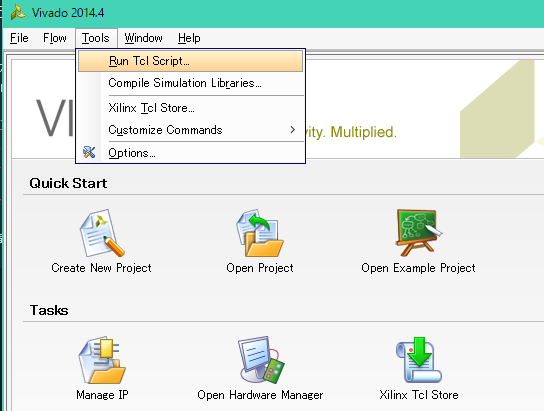
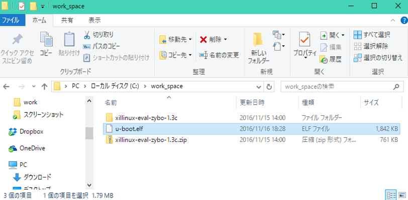
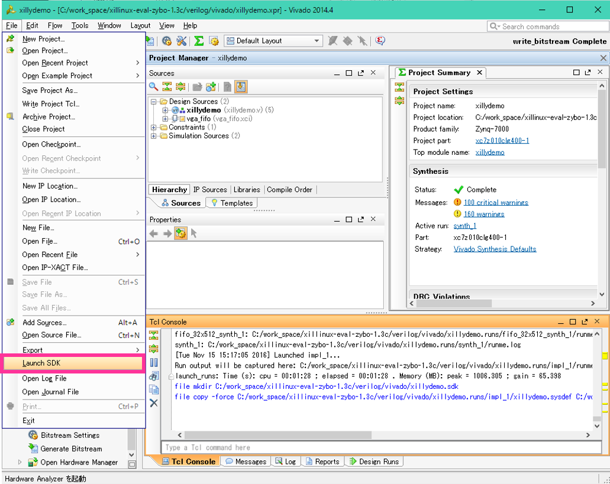
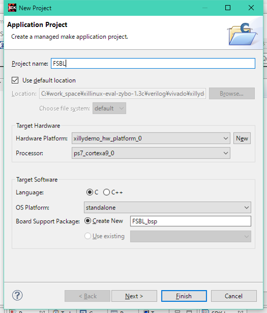
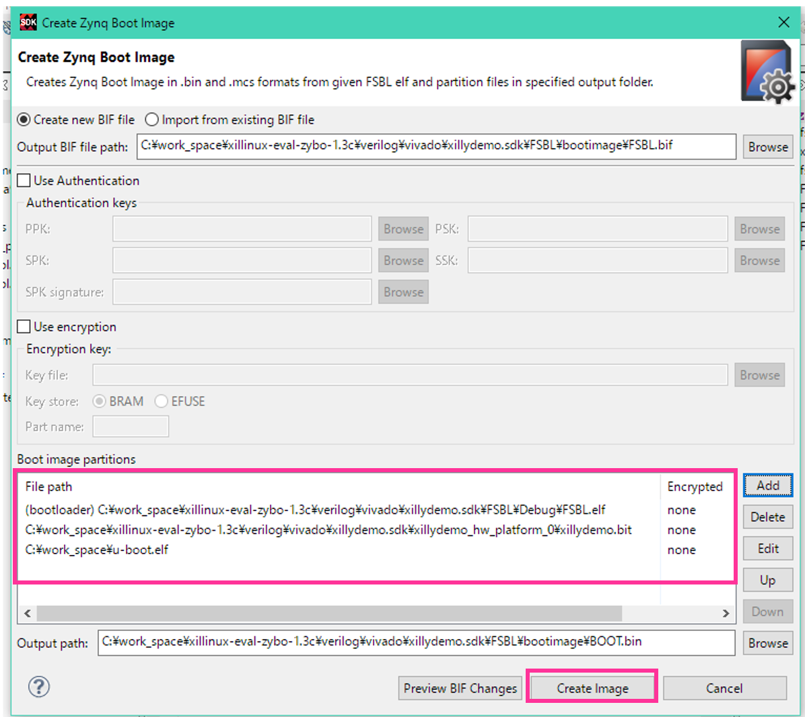

# Xillybus and ROS on Ubuntu on Zybo

###Goal of this tutorial

Bilding a system which runs Xillybus IP and ROS(Robot Operarting System) Indigo on Ubuntu14.04 on [Zybo](https://reference.digilentinc.com/reference/programmable-logic/zybo/start)

###Environment of build

This tutorial uses both Windows and Linux, so please install Vivado + SDK 14.04 later each machine.

- Linux: Ubuntu16.04 64bit
	- Vivado 2014.4
- Windows : Windows10 (For hardware synthesis. Only Linux PC is OK)
	- Vivado 2014.4
- Zybo
- microSD 16GB : 8GB or more is recommended!

<a name="Contents"></a>
###Contents

<!-- MarkdownTOC autolink="true" autoanchor="true" bracket="round" depth="3" -->

- [Build hardware @Windows](#build-hardware-windows)
- [Build u-boot @Ubuntu](#build-u-boot-ubuntu)
- [Generation of BOOT.bin @Windows](#generation-of-bootbin-windows)
- [Build Linux kernel @Ubuntu](#build-linux-kernel-ubuntu)
- [Build device tree file\(dtb\) @Ubuntu](#build-device-tree-filedtb-ubuntu)
- [Description of uEnv.txt @Ubuntu](#description-of-uenvtxt-ubuntu)
- [Get Ubuntu root file system @Ubuntu](#get-ubuntu-root-file-system-ubuntu)
- [Setting SD for boot @Ubuntu](#setting-sd-for-boot-ubuntu)
- [Writing data to SD @Ubuntu](#writing-data-to-sd-ubuntu)
- [Boot test @Windows](#boot-test-windows)
- [Setting on Zybo @Zybo](#setting-on-zybo-zybo)
	- [Setting permissions of Xillybus device driver](#setting-permissions-of-xillybus-device-driver)
	- [Create swap area](#create-swap-area)
	- [Proxy setting](#proxy-setting)
	- [Installation of various tools](#installation-of-various-tools)
- [Run demo application @Zybo](#run-demo-application-zybo)
- [Installation of ROS indigo @Zybo](#installation-of-ros-indigo-zybo)
- [Complete!](#complete)
- [Reference](#reference)
- [Various Documents](#various-documents)

<!-- /MarkdownTOC -->

<a name="build-hardware-windows"></a>
##Build hardware @Windows

Firstly, create a work space under drive C (`C:\work_space`).

Please download a base design of Xillybus for Zybo from [direct link](http://xillybus.com/downloads/xillinux-eval-zybo-1.3c.zip) and save your work space.
[Xillybus](http://xillybus.com/)

`C:\work_space\xillinux-eval-zybo-1.3c.zip`

When archive file is unpacked, it will have the following directory structure.

```
xillinux-eval-zybo-1.3c/
|--bootfiles/
|--cores/
|--runonce/
|--system/
|--verilog/
|--vhdl/
|--vivado-essentials/
```

Start up Vivado 14.04. When starting Vivado, select `Tools -> Run Tcl Script` and specify `C:\work_space\xillinux-eval-zybo-1.3c\verilog\xillydemo-vivado.tcl`.



The Vivado project of Xillybus will start and execute **Generate Bitstream**.


When **Generate Bitstream** completed, following dialog will open. Then select Cancel.


[Return Contents](#Contents)

<a name="build-u-boot-ubuntu"></a>
##Build u-boot @Ubuntu

On ubuntu, create a work directory `~/work_dir`

```
$ mkdir ~/work_dir
$ cd ~/work_dir
```

Next, setting Vivado14.04

```
$ source /opt/Xilinx/Vivado/2014.4/settings64.sh
```

Get source code for u-boot from github repository.

```
$ git clone -b master-next https://github.com/DigilentInc/u-boot-Digilent-Dev.git
$ cd u-boot-Digilent-Dev/
```

Configure for Zybo.

```
$ make CROSS_COMPILE=arm-xilinx-linux-gnueabi- zynq_zybo_config
```

Build.

```
$ make CROSS_COMPILE=arm-xilinx-linux-gnueabi-
```


If **u-boot** was generated under `~/u-boot-Digilent-Dev/`, building is successful.  
Copy the **u-boot** under `C:\work_space` at windows PC and named **u-boot.elf**.



[Return Contents](#Contents)


<a name="generation-of-bootbin-windows"></a>
##Generation of BOOT.bin @Windows

Export hardware of the built project on Vivado, so select `File->Export->Export Hardware`.


Following dialog will open, check **Include bitstream** and OK.


Boot SDK and Select `File->Launch SDK`.



Following dialog will open and select OK.


The project of Xillybus will be generated on SDK.


Select `File->New->Application Project`


In following dialog, please input **FSBL** as a Project Name and select Next.



In Template, please select **Zynq FSBL** and Finish


The project of FSBL is generated and built automatically, **FSBL.elf** is generated under `C:\work_space\xillinux-eval-zybo-1.3c\verilog\vivado\xillydemo.sdk\FSBL\Debug`.


In SDK, right-click on folder named FSBL, select **Create Boot Image** from the menu.


Select **Add** and specify `C:\work_space\u-boot.elf`, and please OK on following dialog.


The files are as follows.

- (bootloader) FSBL.elf
- xillydemo.bit
- u-boot.elf

If **xillydemo.bit** is not selected, specify `C:\work_space\xillinux-eval-zybo-1.3c\verilog\vivado\xillydemo.sdk\xillydemo_hw_platform_0\xillydemo.bit` and **Add**

When you could confirm the files, please **Create Image**.



If **BOOT.bin** is generated under `C:\work_space\xillinux-eval-zybo-1.3c\verilog\vivado\xillydemo.sdk\FSBL\bootimage`, building is successful.  
Copy BOOT.bin
Copy BOOT.bin to `~/work_dir` on Ubuntu PC.

[Return to Contents](#Contents)

<a name="build-linux-kernel-ubuntu"></a>
##Build Linux kernel @Ubuntu

Get source code for Linux kernel from github repository

```
$ cd ~/work_dir
$ git clone -b master-next https://github.com/DigilentInc/Linux-Digilent-Dev.git
$ cd Linux-Digilent-Dev/
```

Configure for Zybo.

```
$ make ARCH=arm CROSS_COMPILE=arm-xilinx-linux-gnueabi- xilinx_zynq_defconfig
```

Then, edit `~/work_dir/Linux-Digilent-Dev/.config` to embed device driver of Xillybus in linux kernel.

```diff
# .config
# Around line 1503, find "XILLYBUS"
- # CONFIG_XILLYBUS is not set
+ CONFIG_XILLYBUS=y
```

Please build. Build takes some moments.

```
$ make ARCH=arm CROSS_COMPILE=arm-xilinx-linux-gnueabi-
```

If build is started, you will be asked for some questions. Then please select **y (yes)**.

```
Xillybus over PCIe (XILLYBUS_PCIE) [N/m/y/?] (NEW) y
Xillybus over Device Tree (XILLYBUS_OF) [N/m/y/?] (NEW) y
```

If build is successful, **zImage** will be generated under `~/work_dir/Linux-Digilent-Dev/arch/arm/boot/`.

Build uImage.

```
$ make ARCH=arm CROSS_COMPILE=arm-xilinx-linux-gnueabi- UIMAGE_LOADADDR=0x8000 uImage
```

If build is successful, **uImage** will be generated under `~/work_dir/Linux-Digilent-Dev/arch/arm/boot/`.  
Copy uImage to `~/work_dir/`.

```
$ cd ~/work_dir/
$ cp Linux-Digilent-Dev/arch/arm/boot/uImage .
$ ls
BOOT.bin  Linux-Digilent-Dev  u-boot-Digilent-Dev  uImage
```


[Return to Contents](#Contents)

<a name="build-device-tree-filedtb-ubuntu"></a>
##Build device tree file(dtb) @Ubuntu

The file which uses for make device tree file (dtb) is `/work_dir/Linux-Digilent-Dev/arch/arm/boot/dts/zynq-zybo.dts`  
Then edit **zynq-zybo.dts**.

Copy **zynq-zybo.dts** to `~/work_dir`.

```
$ cd ~/work_dir
$ cp Linux-Digilent-Dev/arch/arm/boot/dts/zynq-zybo.dts .
$ ls
BOOT.bin  Linux-Digilent-Dev  u-boot-Digilent-Dev  uImage  zynq-zybo.dts
```

Edit contents of **zynq-zybo.dts** are as follows.

```diff
/*Around line 41*/
	chosen {
-		bootargs = "console=ttyPS0,115200 root=/dev/ram rw earlyprintk";
+		bootargs = "console=ttyPS0,115200 root=/dev/mmcblk0p2 rw earlyprintk rootfstype=ext4 rootwait devtmpfs.mount=1";
		linux,stdout-path = "/amba@0/serial@e0001000";
	} ;
+	xillinux {
+		board = "zybo";
+		audio = "ssm2603";
+	} ;
	cpus {
			#address-cells = <1>;
			#size-cells = <0>;
			ps7_cortexa9_0: cpu@0 {
				bus-handle = <&ps7_axi_interconnect_0>;
				clock-latency = <1000>;
				clocks = <&clkc 3>;
				compatible = "arm,cortex-a9";
				device_type = "cpu";
				interrupt-handle = <&ps7_scugic_0>;
-				operating-points = <666667 1000000 333334 1000000 222223 1000000>;
+				operating-points = <650000 1000000>;
				reg = <0x0>;
		} ;
:
:
:
/*Around line 329*/
		ps7_xadc: ps7-xadc@f8007100 {
			clocks = <&clkc 12>;
			compatible = "xlnx,zynq-xadc-1.00.a";
			interrupt-parent = <&ps7_scugic_0>;
			interrupts = <0 7 4>;
			reg = <0xf8007100 0x20>;
		} ;
+		xillyvga@50001000 {
+			compatible = "xillybus,xillyvga-1.00.a";
+			reg = < 0x50001000 0x1000 >;
+		} ;
+		xillybus@50000000 {
+			compatible = "xillybus,xillybus-1.00.a";
+			reg = < 0x50000000 0x1000 >;
+			interrupts = < 0 59 1 >;
+			interrupt-parent = <&ps7_scugic_0>;
+			dma-coherent;
+		} ;
+		xillybus_lite@50002000 {
+			compatible = "xillybus,xillybus_lite_of-1.00.a";
+			reg = < 0x50002000 0x1000 >;
+			interrupts = < 0 58 1 >;
+			interrupt-parent = <&ps7_scugic_0>;
+		} ;
	} ;
} ;
```

When edit is completed, build device tree file.

```
$ cd ~/work_dir/Linux-Digilent-Dev
$ ./scripts/dtc/dtc -I dts -O dtb -o ../devicetree.dtb ../zynq-zybo.dts
```

If build is successful, devicetree.dtb will be generated under `~/work_dir`.

[Return to Contents](#Contents)

<a name="description-of-uenvtxt-ubuntu"></a>
##Description of uEnv.txt @Ubuntu

Describe uEnv.txt.

```
$ cd ~/work_dir
$ cat <<EOT>> uEnv.txt
uenvcmd=fatload mmc 0 0x03000000 uImage && fatload mmc 0 0x02A00000 devicetree.dtb && bootm 0x03000000 - 0x02A00000
EOT
```

[Return to Contents](#Contents)

<a name="get-ubuntu-root-file-system-ubuntu"></a>
##Get Ubuntu root file system @Ubuntu

You can download root file system of Ubuntu14.04 from following URL.  
In this tutorial, the file system is obtained by wget command, so download is not required on web site.

**[http://www.armhf.com/download/](http://www.armhf.com/download/)**


Download a root file system of Ubuntu14.04 to `~/work_dir`.

```
$ cd ~/work_dir
$ wget http://s3.armhf.com/dist/basefs/ubuntu-trusty-14.04-armhf.com-20140603.tar.xz
```

Make a directory and unpack the file system at this directory.

```
$ mkdir ubuntu_rootfs
$ cd ubuntu_rootfs
$ tar -Jxvf ../ubuntu-trusty-14.04-armhf.com-20140603.tar.xz
```

When the unpacking is successful, the following directories are generated. 

```
bin  boot  dev  etc  home  lib  media  mnt  opt
proc  root  run  sbin  srv  sys  tmp  usr  var
```

[Return to Contents](#Contents)

<a name="setting-sd-for-boot-ubuntu"></a>
##Setting SD for boot @Ubuntu

Make partitions on a SD card (microSD) for boot Ubuntu on Zybo.  
The SD card which has 8GB and more is recommended.  

Please confirm mount information by lsblk command after insert of SD card to Ubuntu PC.  

```
$ lsblk 
NAME                 MAJ:MIN RM   SIZE RO TYPE MOUNTPOINT
sda                    8:0    0 465.8G  0 disk 
├─sda1                 8:1    0   100M  0 part /media/kazushi/
├─sda2                 8:2    0   117G  0 part /media/kazushi/F08875B788757D42
├─sda3                 8:3    0  31.3G  0 part /media/kazushi/DATA
├─sda5                 8:5    0   500M  0 part /media/kazushi/17c35461-41ed-4453-a0c7-b02c06fd6cae
└─sda6                 8:6    0   317G  0 part 
  ├─vg_degin-lv_root 252:0    0    50G  0 lvm  /media/kazushi/213acf4e-1831-423a-8b40-90f9cb41d727
  ├─vg_degin-lv_home 252:1    0 263.1G  0 lvm  /media/kazushi/01618d57-6dc1-4817-9980-3fd6b5134a73
  └─vg_degin-lv_swap 252:2    0   3.9G  0 lvm  
sdb                    8:16   0 232.9G  0 disk 
├─sdb1                 8:17   0   7.5G  0 part [SWAP]
└─sdb5                 8:21   0 225.4G  0 part /
sdc                    8:32   1  14.9G  0 disk 
sr0                   11:0    1  1024M  0 rom  
loop0                  7:0    0   1.7G  0 loop /mnt
```

Make partitions by fdisk command. Please delete old partitions on your SD card.  

Make first partition. This partition includes boot loader, Linux kernel and so on.

- p : primary, First sector : default, Last sector : +64Mbyte

```
$ sudo fdisk /dev/sdc 

Welcome to fdisk (util-linux 2.27.1).
Changes will remain in memory only, until you decide to write them.
Be careful before using the write command.

Command (m for help): p
Disk /dev/sdc: 14.9 GiB, 15931539456 bytes, 31116288 sectors
Units: sectors of 1 * 512 = 512 bytes
Sector size (logical/physical): 512 bytes / 512 bytes
I/O size (minimum/optimal): 512 bytes / 512 bytes
Disklabel type: dos
Disk identifier: 0xcc4a40d8

Command (m for help): n
Partition type
   p   primary (0 primary, 0 extended, 4 free)
   e   extended (container for logical partitions)
Select (default p): p
Partition number (1-4, default 1): 1
First sector (2048-31116287, default 2048): 
Last sector, +sectors or +size{K,M,G,T,P} (2048-31116287, default 31116287): +64M

Created a new partition 1 of type 'Linux' and of size 64 MiB.

Command (m for help): p
Disk /dev/sdc: 14.9 GiB, 15931539456 bytes, 31116288 sectors
Units: sectors of 1 * 512 = 512 bytes
Sector size (logical/physical): 512 bytes / 512 bytes
I/O size (minimum/optimal): 512 bytes / 512 bytes
Disklabel type: dos
Disk identifier: 0xcc4a40d8

Device Boot      Start  End      Blocks   Id  System
/dev/sdc1        2048   133119 131072  64M 83 Linux
```

Next, make second partition.

- p : primary, First sector : default, Last sector : default

```
Command (m for help): n
Partition type
   p   primary (0 primary, 0 extended, 4 free)
   e   extended (container for logical partitions)
Select (default p): p
Partition number (1-4, default 1): 1
First sector (2048-31116287, default 2048): 
Last sector, +sectors or +size{K,M,G,T,P} (2048-31116287, default 31116287): +64M

Created a new partition 1 of type 'Linux' and of size 64 MiB.

Command (m for help): p
Disk /dev/sdc: 14.9 GiB, 15931539456 bytes, 31116288 sectors
Units: sectors of 1 * 512 = 512 bytes
Sector size (logical/physical): 512 bytes / 512 bytes
I/O size (minimum/optimal): 512 bytes / 512 bytes
Disklabel type: dos
Disk identifier: 0xcc4a40d8

/dev/sdc1        2048   133119 131072  64M 83 Linux

Command (m for help): n
Partition type
   p   primary (1 primary, 0 extended, 3 free)
   e   extended (container for logical partitions)
Select (default p): p
Partition number (2-4, default 2): 2
First sector (133120-31116287, default 133120): 
Last sector, +sectors or +size{K,M,G,T,P} (133120-31116287, default 31116287): 

Created a new partition 2 of type 'Linux' and of size 14.8 GiB.

Command (m for help): p
Disk /dev/sdc: 14.9 GiB, 15931539456 bytes, 31116288 sectors
Units: sectors of 1 * 512 = 512 bytes
Sector size (logical/physical): 512 bytes / 512 bytes
I/O size (minimum/optimal): 512 bytes / 512 bytes
Disklabel type: dos
Disk identifier: 0xcc4a40d8

Device Boot      Start    End      Blocks   Id  System
/dev/sdc1         2048   133119   131072   64M 83 Linux
/dev/sdc2       133120 31116287 30983168 14.8G 83 Linux

```

Change system type of first partition to FAT32(Command : b).

```
Command (m for help): t
Partition number (1,2, default 2): 1
Partition type (type L to list all types): L

 0  Empty           24  NEC DOS         81  Minix / old Lin bf  Solaris
 1  FAT12           27  Hidden NTFS Win 82  Linux swap / So c1  DRDOS/sec (FAT-
 2  XENIX root      39  Plan 9          83  Linux           c4  DRDOS/sec (FAT-
 3  XENIX usr       3c  PartitionMagic  84  OS/2 hidden C:  c6  DRDOS/sec (FAT-
 4  FAT16 <32M      40  Venix 80286     85  Linux extended  c7  Syrinx
 5  Extended        41  PPC PReP Boot   86  NTFS volume set da  Non-FS data
 6  FAT16           42  SFS             87  NTFS volume set db  CP/M / CTOS / .
 7  HPFS/NTFS/exFAT 4d  QNX4.x          88  Linux plaintext de  Dell Utility
 8  AIX             4e  QNX4.x 2nd part 8e  Linux LVM       df  BootIt
 9  AIX bootable    4f  QNX4.x 3rd part 93  Amoeba          e1  DOS access
 a  OS/2 Boot Manag 50  OnTrack DM      94  Amoeba BBT      e3  DOS R/O
 b  W95 FAT32       51  OnTrack DM6 Aux 9f  BSD/OS          e4  SpeedStor
 c  W95 FAT32 (LBA) 52  CP/M            a0  IBM Thinkpad hi eb  BeOS fs
 e  W95 FAT16 (LBA) 53  OnTrack DM6 Aux a5  FreeBSD         ee  GPT
 f  W95 Ext'd (LBA) 54  OnTrackDM6      a6  OpenBSD         ef  EFI (FAT-12/16/
10  OPUS            55  EZ-Drive        a7  NeXTSTEP        f0  Linux/PA-RISC b
11  Hidden FAT12    56  Golden Bow      a8  Darwin UFS      f1  SpeedStor
12  Compaq diagnost 5c  Priam Edisk     a9  NetBSD          f4  SpeedStor
14  Hidden FAT16 <3 61  SpeedStor       ab  Darwin boot     f2  DOS secondary
16  Hidden FAT16    63  GNU HURD or Sys af  HFS / HFS+      fb  VMware VMFS
17  Hidden HPFS/NTF 64  Novell Netware  b7  BSDI fs         fc  VMware VMKCORE
18  AST SmartSleep  65  Novell Netware  b8  BSDI swap       fd  Linux raid auto
1b  Hidden W95 FAT3 70  DiskSecure Mult bb  Boot Wizard hid fe  LANstep
1c  Hidden W95 FAT3 75  PC/IX           be  Solaris boot    ff  BBT
1e  Hidden W95 FAT1 80  Old Minix
Partition type (type L to list all types): b

Changed type of partition 'Linux' to 'W95 FAT32'.

Command (m for help): p
Disk /dev/sdc: 14.9 GiB, 15931539456 bytes, 31116288 sectors
Units: sectors of 1 * 512 = 512 bytes
Sector size (logical/physical): 512 bytes / 512 bytes
I/O size (minimum/optimal): 512 bytes / 512 bytes
Disklabel type: dos
Disk identifier: 0xcc4a40d8

Device Boot      Start   End      Blocks   Id  System
/dev/sdc1        2048   133119   131072   64M  b W95 FAT32
/dev/sdc2       133120 31116287 30983168 14.8G 83 Linux

```

Finally, the SD card setting finishes by writing configuration with command **w**.

Configure partition name.

**First partition**

```
$ sudo mkfs.msdos -n ZYBO_BOOT /dev/sdc1
mkfs.fat 3.0.28 (2015-05-16)
```

**Second partition**

```
$ sudo mkfs.ext4 -L ROOT_FS /dev/sdc2
mke2fs 1.42.13 (17-May-2015)
Creating filesystem with 3872896 4k blocks and 969136 inodes
Filesystem UUID: ce0cea9c-5942-496f-92cf-6dbeafa46834
Superblock backups stored on blocks: 
	32768, 98304, 163840, 229376, 294912, 819200, 884736, 1605632, 2654208

Allocating group tables: done
Writing inode tables: done
Creating journal (32768 blocks): done
Writing superblocks and filesystem accounting information: done
```

[Return to Contents](#Contents)

<a name="writing-data-to-sd-ubuntu"></a>
##Writing data to SD @Ubuntu

Copy some files to SD card.  
The files is following list.

- ZYBO_ROOT
	- BOOT.bin
	- devicetree.dtb
	- uEnv.txt
	- uImage
- ROOT_FS
	- Ubuntu root file system

**ZYBO_ROOT**

```
$ cd ~/work_dir
$ cp BOOT.bin /media/user_name/ZYBO_BOOT/.
$ cp devicetree.dtb /media/user_name/ZYBO_BOOT/.
$ cp uEnv.txt /media/user_name/ZYBO_BOOT/.
$ cp uImage /media/user_name/ZYBO_BOOT/.
$ ls /media/user_name/ZYBO_BOOT/
BOOT.bin  devicetree.dtb  uEnv.txt  uImage
```

**ROOT_FS**

```
$ cd ~/work_dir/ubuntu_rootfs
$ sudo cp -rf * /media/user_name/ROOT_FS/.
```

When writing finished, create configuration file which is for serial connection.

```
$ cd /media/user_name/ROOT_FS/etc/init
$ sudo touch ttyPS0.conf
```

The file contents is follows.

```
# ttyPS0 - getty
#
# This service maintains a getty on ttyPS0 from the point the system is
# started until it is shut down again.

start on stopped rc RUNLEVEL=[2345] and (
            not-container or
            container CONTAINER=lxc or
            container CONTAINER=lxc-libvirt)

stop on runlevel [!2345]

respawn
exec /sbin/getty -8 -a root 115200 ttyPS0
```

The SD card writing finished.

[Return to Contents](#Contents)

<a name="boot-test-windows"></a>
##Boot test @Windows

Please connect Zybo to PC with USB cable.  
Serial console can be used with [Tera Term](https://ttssh2.osdn.jp/), screen command, Terminal(OSX) and so on.  

The following is a boot log.

```
Device: zynq_sdhci
Manufacturer ID: 74
OEM: 4a60
Name: 00000
Tran Speed: 25000000
Rd Block Len: 512
SD version 1.0
High Capacity: Yes
Capacity: 14.7 GiB
Bus Width: 4-bit
reading uEnv.txt
116 bytes read in 9 ms (11.7 KiB/s)
Loaded environment from uEnv.txt
Importing environment from SD ...
Running uenvcmd ...
reading uImage
3464120 bytes read in 595 ms (5.6 MiB/s)
reading devicetree.dtb
7859 bytes read in 19 ms (403.3 KiB/s)
## Booting kernel from Legacy Image at 03000000 ...
   Image Name:   Linux-3.18.0-xilinx-46110-gd627f
   Image Type:   ARM Linux Kernel Image (uncompressed)
   Data Size:    3464056 Bytes = 3.3 MiB
   Load Address: 00008000
   Entry Point:  00008000
   Verifying Checksum ... OK
## Flattened Device Tree blob at 02a00000
   Booting using the fdt blob at 0x2a00000
   Loading Kernel Image ... OK
   Loading Device Tree to 1fb2a000, end 1fb2eeb2 ... OK

Starting kernel ...

Booting Linux on physical CPU 0x0
Linux version 3.18.0-xilinx-46110-gd627f5d (kazushi@degin) (gcc version 4.8.3 20140320 (prerelease) (Sourcery CodeBench Lite 2014.05-23) ) #1 SMP PREEMPT Thu Nov 17 18:55:11 JST 2016
CPU: ARMv7 Processor [413fc090] revision 0 (ARMv7), cr=18c5387d
CPU: PIPT / VIPT nonaliasing data cache, VIPT aliasing instruction cache
Machine model: Xilinx Zynq
cma: Reserved 16 MiB at 0x1e800000
Memory policy: Data cache writealloc
PERCPU: Embedded 10 pages/cpu @5fbd3000 s8768 r8192 d24000 u40960
Built 1 zonelists in Zone order, mobility grouping on.  Total pages: 130048
Kernel command line: console=ttyPS0,115200 root=/dev/mmcblk0p2 rw earlyprintk rootfstype=ext4 rootwait devtmpfs.mount=1
PID hash table entries: 2048 (order: 1, 8192 bytes)
Dentry cache hash table entries: 65536 (order: 6, 262144 bytes)
Inode-cache hash table entries: 32768 (order: 5, 131072 bytes)
Memory: 496196K/524288K available (4694K kernel code, 259K rwdata, 1620K rodata, 212K init, 219K bss, 28092K reserved, 0K highmem)
Virtual kernel memory layout:
    vector  : 0xffff0000 - 0xffff1000   (   4 kB)
    fixmap  : 0xffc00000 - 0xffe00000   (2048 kB)
    vmalloc : 0x60800000 - 0xff000000   (2536 MB)
    lowmem  : 0x40000000 - 0x60000000   ( 512 MB)
    pkmap   : 0x3fe00000 - 0x40000000   (   2 MB)
    modules : 0x3f000000 - 0x3fe00000   (  14 MB)
      .text : 0x40008000 - 0x40632aa4   (6315 kB)
      .init : 0x40633000 - 0x40668000   ( 212 kB)
      .data : 0x40668000 - 0x406a8f60   ( 260 kB)
       .bss : 0x406a8f60 - 0x406dfe78   ( 220 kB)
Preemptible hierarchical RCU implementation.
        Dump stacks of tasks blocking RCU-preempt GP.
        RCU restricting CPUs from NR_CPUS=4 to nr_cpu_ids=2.
RCU: Adjusting geometry for rcu_fanout_leaf=16, nr_cpu_ids=2
NR_IRQS:16 nr_irqs:16 16
L2C-310 erratum 769419 enabled
L2C-310 enabling early BRESP for Cortex-A9
L2C-310 full line of zeros enabled for Cortex-A9
L2C-310 ID prefetch enabled, offset 1 lines
L2C-310 dynamic clock gating enabled, standby mode enabled
L2C-310 cache controller enabled, 8 ways, 512 kB
L2C-310: CACHE_ID 0x410000c8, AUX_CTRL 0x76360001
ps7-slcr mapped to 60804000
zynq_clock_init: clkc starts at 60804100
Zynq clock init
sched_clock: 64 bits at 325MHz, resolution 3ns, wraps every 3383112499200ns
ps7-ttc #0 at 60806000, irq=43
Console: colour dummy device 80x30
Calibrating delay loop... 1292.69 BogoMIPS (lpj=6463488)
pid_max: default: 32768 minimum: 301
Mount-cache hash table entries: 1024 (order: 0, 4096 bytes)
Mountpoint-cache hash table entries: 1024 (order: 0, 4096 bytes)
CPU: Testing write buffer coherency: ok
CPU0: thread -1, cpu 0, socket 0, mpidr 80000000
Setting up static identity map for 0x46f398 - 0x46f3f0
CPU1: Booted secondary processor
CPU1: thread -1, cpu 1, socket 0, mpidr 80000001
Brought up 2 CPUs
SMP: Total of 2 processors activated.
CPU: All CPU(s) started in SVC mode.
devtmpfs: initialized
VFP support v0.3: implementor 41 architecture 3 part 30 variant 9 rev 4
regulator-dummy: no parameters
NET: Registered protocol family 16
DMA: preallocated 256 KiB pool for atomic coherent allocations
cpuidle: using governor ladder
cpuidle: using governor menu
hw-breakpoint: found 5 (+1 reserved) breakpoint and 1 watchpoint registers.
hw-breakpoint: maximum watchpoint size is 4 bytes.
zynq-ocm f800c000.ps7-ocmc: ZYNQ OCM pool: 256 KiB @ 0x60880000
vgaarb: loaded
SCSI subsystem initialized
usbcore: registered new interface driver usbfs
usbcore: registered new interface driver hub
usbcore: registered new device driver usb
media: Linux media interface: v0.10
Linux video capture interface: v2.00
pps_core: LinuxPPS API ver. 1 registered
pps_core: Software ver. 5.3.6 - Copyright 2005-2007 Rodolfo Giometti <giometti@linux.it>
PTP clock support registered
EDAC MC: Ver: 3.0.0
Advanced Linux Sound Architecture Driver Initialized.
Switched to clocksource arm_global_timer
NET: Registered protocol family 2
TCP established hash table entries: 4096 (order: 2, 16384 bytes)
TCP bind hash table entries: 4096 (order: 3, 32768 bytes)
TCP: Hash tables configured (established 4096 bind 4096)
TCP: reno registered
UDP hash table entries: 256 (order: 1, 8192 bytes)
UDP-Lite hash table entries: 256 (order: 1, 8192 bytes)
NET: Registered protocol family 1
RPC: Registered named UNIX socket transport module.
RPC: Registered udp transport module.
RPC: Registered tcp transport module.
RPC: Registered tcp NFSv4.1 backchannel transport module.
hw perfevents: enabled with armv7_cortex_a9 PMU driver, 7 counters available
futex hash table entries: 512 (order: 3, 32768 bytes)
jffs2: version 2.2. (NAND) (SUMMARY)  c 2001-2006 Red Hat, Inc.
msgmni has been set to 1001
io scheduler noop registered
io scheduler deadline registered
io scheduler cfq registered (default)
dma-pl330 f8003000.ps7-dma: Loaded driver for PL330 DMAC-241330
dma-pl330 f8003000.ps7-dma:     DBUFF-128x8bytes Num_Chans-8 Num_Peri-4 Num_Events-16
xuartps e0001000.serial: ttyPS0 at MMIO 0xe0001000 (irq = 82, base_baud = 3125000) is a xuartps
console [ttyPS0] enabled
xdevcfg f8007000.ps7-dev-cfg: ioremap 0xf8007000 to 6086c000
xillybus_of 50000000.xillybus: Created 7 device files.
[drm] Initialized drm 1.1.0 20060810
brd: module loaded
loop: module loaded
CAN device driver interface
e1000e: Intel(R) PRO/1000 Network Driver - 2.3.2-k
e1000e: Copyright(c) 1999 - 2014 Intel Corporation.
libphy: XEMACPS mii bus: probed
xemacps e000b000.ps7-ethernet: invalid address, use random
xemacps e000b000.ps7-ethernet: MAC updated 06:86:03:13:74:ee
xemacps e000b000.ps7-ethernet: pdev->id -1, baseaddr 0xe000b000, irq 54
ehci_hcd: USB 2.0 'Enhanced' Host Controller (EHCI) Driver
ehci-pci: EHCI PCI platform driver
ULPI transceiver vendor/product ID 0x0424/0x0007
Found SMSC USB3320 ULPI transceiver.
ULPI integrity check: passed.
zynq-ehci zynq-ehci.0: Xilinx Zynq USB EHCI Host Controller
zynq-ehci zynq-ehci.0: new USB bus registered, assigned bus number 1
zynq-ehci zynq-ehci.0: irq 53, io mem 0x00000000
zynq-ehci zynq-ehci.0: USB 2.0 started, EHCI 1.00
hub 1-0:1.0: USB hub found
hub 1-0:1.0: 1 port detected
usbcore: registered new interface driver usb-storage
mousedev: PS/2 mouse device common for all mice
i2c /dev entries driver
Xilinx Zynq CpuIdle Driver started
sdhci: Secure Digital Host Controller Interface driver
sdhci: Copyright(c) Pierre Ossman
sdhci-pltfm: SDHCI platform and OF driver helper
sdhci-arasan e0100000.ps7-sdio: No vmmc regulator found
sdhci-arasan e0100000.ps7-sdio: No vqmmc regulator found
mmc0: SDHCI controller on e0100000.ps7-sdio [e0100000.ps7-sdio] using ADMA
ledtrig-cpu: registered to indicate activity on CPUs
usbcore: registered new interface driver usbhid
usbhid: USB HID core driver
TCP: cubic registered
NET: Registered protocol family 17
can: controller area network core (rev 20120528 abi 9)
NET: Registered protocol family 29
can: raw protocol (rev 20120528)
can: broadcast manager protocol (rev 20120528 t)
can: netlink gateway (rev 20130117) max_hops=1
zynq_pm_ioremap: no compatible node found for 'xlnx,zynq-ddrc-a05'
zynq_pm_late_init: Unable to map DDRC IO memory.
Registering SWP/SWPB emulation handler
drivers/rtc/hctosys.c: unable to open rtc device (rtc0)
ALSA device list:
  No soundcards found.
mmc0: new SDHC card at address 0001
mmcblk0: mmc0:0001 00000 14.7 GiB
 mmcblk0: p1 p2
EXT4-fs (mmcblk0p2): mounted filesystem with ordered data mode. Opts: (null)
VFS: Mounted root (ext4 filesystem) on device 179:2.
devtmpfs: mounted
Freeing unused kernel memory: 212K (40633000 - 40668000)
Mount failed for selinuxfs on /sys/fs/selinux:  No such file or directory
｡-+t: plymouth-upstart-bridge main process (603) terminated with status 1
ﾍﾍ*ｹｱﾍﾁ?･ｹ5init: plymouth-upstart-bridge main process (613) terminated with status｡Z+
ﾍﾍ*ｹｱﾍﾁ?･ｹ5init: plymouth-upstart-bridge main process (616) terminated with status｡Z+
ﾍﾍ*ｹｱﾍﾁ?･ｹ5init: plymouth-upstart-bridge main process (618) terminated with status｡Z+
ﾍﾍ*ｹｱﾍﾁ?･ｹ5init: plymouth-upstart-bridge main process (622) terminated with status｡Z+
ﾍﾍ*ｹｱﾍﾁ?･ｹ5init: ureadahead main process (606) terminated with status 5
 * Stopping Send an event to indicate plymouth is up                     [ OK ]
 * Starting Mount filesystems on boot                                    [ OK ]
 * Starting Signal sysvinit that the rootfs is mounted                   [ OK ]
 * Starting Populate /dev filesystem                                     [ OK ]
 * Stopping Populate /dev filesystem                                     [ OK ]
 * Starting Clean /tmp directory                                         [ OK ]
 * Starting Populate and link to /run filesystem                         [ OK ]
 * Stopping Populate and link to /run filesystem                         [ OK ]
 * Stopping Clean /tmp directory                                         [ OK ]
 * Stopping Track if upstart is running in a container                   [ OK ]
 * Starting Initialize or finalize resolvconf                            [ OK ]
 * Starting set console keymap                                           [ OK ]
 * Starting Signal sysvinit that virtual filesystems are mounted         [ OK ]
 * Starting Signal sysvinit that virtual filesystems are mounted         [ OK ]
 * Starting Bridge udev events into upstart                              [ OK ]
 * Stopping set console keymap                                           [ OK ]
 * Starting Signal sysvinit that local filesystems are mounted           [ OK ]
 * Starting device node and kernel event manager                         [ OK ]
 * Starting Signal sysvinit that remote filesystems are mounted          [ OK ]
 * Starting load modules from /etc/modules                               [ OK ]
 * Starting cold plug devices                                            [ OK ]
 * Starting log initial device creation                                  [ OK ]
 * Stopping load modules from /etc/modules                               [ OK ]
 * Starting flush early job output to logs                               [ OK ]
 * Stopping Mount filesystems on boot                                    [ OK ]
 * Stopping flush early job output to logs                               [ OK ]
 * Stopping cold plug devices                                            [ OK ]
 * Stopping log initial device creation                                  [ OK ]
 * Starting configure network device security                            [ OK ]
 * Starting set console font                                             [ OK ]
 * Stopping set console font                                             [ OK ]
 * Starting userspace bootsplash                                         [ OK ]
 * Starting configure network device security                            [ OK ]
 * Stopping userspace bootsplash                                         [ OK ]
 * Starting Send an event to indicate plymouth is up                     [ OK ]
 * Stopping Send an event to indicate plymouth is up                     [ OK ]
 * Starting configure network device security                            [ OK ]
 * Starting system logging daemon                                        [ OK ]
 * Starting configure virtual network devices                            [ OK ]
 * Starting configure network device                                     [ OK ]
 * Starting Mount network filesystems                                    [ OK ]
 * Starting Failsafe Boot Delay                                          [ OK ]
 * Stopping Mount network filesystems                                    [ OK ]
 * Starting Bridge file events into upstart                              [ OK ]
 * Starting Bridge socket events into upstart                            [ OK ]
 * Starting Mount network filesystems                                    [ OK ]
 * Starting configure network device                                     [ OK ]
 * Stopping Failsafe Boot Delay                                          [ OK ]
 * Starting System V initialisation compatibility                        [ OK ]
 * Stopping Mount network filesystems                                    [ OK ]
 * Stopping System V initialisation compatibility                        [ OK ]
 * Starting System V runlevel compatibility                              [ OK ]
 * Starting save kernel messages                                         [ OK ]
 * Starting regular background program processing daemon                 [ OK ]
 * Stopping System V runlevel compatibility                              [ OK ]

Ubuntu 14.04 LTS ubuntu-armhf ttyPS0

ubuntu-armhf login: root (automatic login)

 * Stopping save kernel messages                                         [ OK ]
Welcome to Ubuntu 14.04 LTS (GNU/Linux 3.18.0-xilinx-46110-gd627f5d armv7l)

 * Documentation:  https://help.ubuntu.com/

The programs included with the Ubuntu system are free software;
the exact distribution terms for each program are described in the
individual files in /usr/share/doc/*/copyright.

Ubuntu comes with ABSOLUTELY NO WARRANTY, to the extent permitted by
applicable law.

root@ubuntu-armhf:~#
root@ubuntu-armhf:~# uname -r
3.18.0-xilinx-46110-gd627f5d
```

[Return to Contents](#Contents)

<a name="setting-on-zybo-zybo"></a>
##Setting on Zybo @Zybo

Change each directory or binary permission.

```
# chmod 4755 /usr/bin/sudo
# chmod 777 /tmp
# chmod o+rwt /tmp
```

In this tutorial, please work in root mode below.  
However, the ubuntu file system which used has a user named **ubuntu (the password is "ubuntu")**.
So, add **ubuntu** to sudo group.

```
# gpasswd -a ubuntu sudo
```

In addition, fix owner and group of `/home/ubuntu`.

```
# cd /home
# chown ubuntu:ubuntu ubuntu/
```

<a name="setting-permissions-of-xillybus-device-driver"></a>
###Setting permissions of Xillybus device driver

Create a configuration file to fix permissions of the Xillybus device driver.

```
# cat <<EOT>> /etc/udev/rules.d/10-xillybus.rules
SUBSYSTEM=="xillybus", MODE="666", OPTIONS="last_rule"
EOT
```

<a name="create-swap-area"></a>
###Create swap area


Working in Zybo may be faster if you create a Swap area.

Create a directory at `/var/cache` for the swap area.

```
# mkdir /var/cache/swap
```

Create a swapfile of 512MB with following command.

```
# dd if=/dev/zero of=/var/cache/swap/swapfile bs=1M count=512
# mkswap /var/cache/swap/swapfile
```


Edit `/etc/fstab` in the built-in editor.  
Add the line `/var/cache/swap/swapfile none swap sw 0 0` in the file.

```
# nano /etc/fstab
```

Please reboot.

```
# reboot
```

You can check the setting with a command swapon.

```
# swapon -s
Filename                                Type            Size    Used    Priority
/var/cache/swap/swapfile                file            524284  0       -1
```

<a name="proxy-setting"></a>
###Proxy setting

If you need to set proxy server, please make the following settings.

**apt-get**

```
# cat <<EOT>> /etc/apt/apt.conf
Acquire::ftp::proxy "ftp://proxy.server.jp:port/";
Acquire::http::proxy "http://proxy.server.jp:port/";
Acquire::https::proxy "https://proxy.server.jp:port/";
Acquire::socks::proxy "socks://proxy.server.jp:port/";
EOT
```

**System proxy**

```
# nano ~/.bashrc
### Add to the end ###
export HTTPS_PROXY=http://proxy.server.jp:port/
export HTTP_PROXY=http://proxy.server.jp:port/
export FTP_PROXY=http://proxy.server.jp:port/

export https_proxy=http://proxy.server.jp:port/
export http_proxy=http://proxy.server.jp:port/
export ftp_proxy=http://proxy.server.jp:port/
```

<a name="installation-of-various-tools"></a>
###Installation of various tools

Please execute `apt-get update`.

```
# apt-get update
```

**ssh**

```
# apt-get install ssh -y
```

Configure ssh option for root login. Edit `/etc/ssh/sshd_config` as follows.

```diff
- PermitRootLogin without-password
+ PermitRootLogin yes
```

Set root password.

```
# passwd
```

**Others**

```
# apt-get install gcc g++ make git -y
```

[Return to Contents](#Contents)

<a name="run-demo-application-zybo"></a>
##Run demo application @Zybo

Switch user to **ubuntu**.

```
# su ubuntu
$ cd
```

Create a directory for demo applications.

```
$ mkdir demoapps
$ cd demoapps
```

In Xillybus, when sending and receiving data between the processing system and the FPGA, you can send and receive data by reading / writing to the device file.

In this tutorial, create two applications for data access and execute on Python.

Create **read.py**, **write.py** with `touch` command

```
touch read.py write.py
```

The source codes are follows.

**read.py**

```python
# -*- coding: utf-8 -*-

import os
import sys

XILLYBUS_READ_32 = "/dev/xillybus_read_32"

def main():
	dev = os.open(XILLYBUS_READ_32, os.O_RDONLY)
	while True:
		string_data = os.read(dev, 1)
		sys.stdout.write(string_data)
		sys.stdout.flush()

if __name__ == '__main__':
	main()
```

**write.py**

```python
# -*- coding: utf-8 -*-

import os
import sys
XILLYBUS_WRITE_32 = "/dev/xillybus_write_32"

def main():
	dev = os.open(XILLYBUS_WRITE_32, os.O_WRONLY)

	while True:
		string_data = sys.stdin.read(1)
		os.write(dev, string_data)

if __name__ == '__main__':
	main()
```

When you execute the programs, please use two terminals.  
Then, input any string on write side, and push Enter key.   
If the string is output on read side, the execution is successful.

**Terminal 1**

```
$ python write.py
123456789
```

**Terminal 2**

```
$ python read.py
123456789
```


[Return to Contents](#Contents)

<a name="installation-of-ros-indigo-zybo"></a>
## Installation of ROS indigo @Zybo

Install ROS indigo.  

Set repository.

```
$ sudo sh -c 'echo "deb http://packages.ros.org/ros/ubuntu trusty main" > /etc/apt/sources.list.d/ros-latest.list'
```

Obtain repository key.

```
$ sudo apt-key adv --keyserver hkp://ha.pool.sks-keyservers.net --recv-key 0xB01FA116
```

Please execute `apt-get update`.

```
$ sudo apt-get update
```

Start up ROS installation with `apt-get install`

```
$ sudo apt-get install ros-indigo-ros-base -y
```

If ROS installation is finished, check operation. Configure PATH(environment variable).

```
$ source /opt/ros/indigo/setup.bash
```

Boot up **roscore**. If the installation has been successful, the following log will be output.  
You can terminate with `ctl + c`

```
$ roscore
... logging to /home/ubuntu/.ros/log/f93a280a-ac28-11e6-95ce-46bea99c65de/roslaunch-ubuntu-armhf-6933.log
Checking log directory for disk usage. This may take awhile.
Press Ctrl-C to interrupt
Done checking log file disk usage. Usage is <1GB.

started roslaunch server http://ubuntu-armhf:44472/
ros_comm version 1.11.20


<a name="summary"></a>
SUMMARY
========

PARAMETERS
 * /rosdistro: indigo
 * /rosversion: 1.11.20

NODES

auto-starting new master
process[master]: started with pid [6944]
ROS_MASTER_URI=http://ubuntu-armhf:11311/

setting /run_id to f93a280a-ac28-11e6-95ce-46bea99c65de
process[rosout-1]: started with pid [6957]
started core service [/rosout]
```

[Return to Contents](#Contents)

<a name="complete"></a>
## Complete!
Congratulation! The build of system is completed!

<a name="reference"></a>
## Reference

In making this tutorial, I have used the following website as a reference.
I greatly appreciate the websites and the creators.  
***I translated the titles of the websites from Japanese to English.***

- [FPGA NO HEYA](http://marsee101.blog19.fc2.com/)
	- [Embedded Linux for ZYBO Tutorial 1 (Upgrade IP)](http://marsee101.blog19.fc2.com/blog-entry-2911.html)
	- [How to create SD card for booting up Embedded Linux on ZYBO](http://marsee101.blog19.fc2.com/blog-entry-2929.html)
	- [Embed root file system of ARMhf into Digilent Linux kernel for ZYBO](http://marsee101.blog19.fc2.com/blog-entry-3056.html)
	- [Build Ubuntu Linux for ZedBoard part 8 (add swap space)](http://marsee101.blog19.fc2.com/blog-entry-2820.html)
- [blog KEITESU : Use Ubuntu root file system on ZYBO](http://keitetsu.blogspot.jp/2015/01/zyboubuntu.html)


<a name="various-documents"></a>
## Various Documents
- [Xillybus Documentaion](http://xillybus.com/doc)
	- [Getting started with Xillinux for Zynq-7000 EPP ](http://xillybus.com/downloads/doc/xillybus_getting_started_zynq.pdf)
	- [Getting started with Xillybus on a Linux host](http://xillybus.com/downloads/doc/xillybus_getting_started_linux.pdf)
	- [The guide to Xillybus Lite](http://xillybus.com/downloads/doc/xillybus_lite.pdf)
- [ROS Wiki : Ubuntu ARM install of ROS Indigo](http://wiki.ros.org/indigo/Installation/UbuntuARM)

[Return to Contents](#Contents)